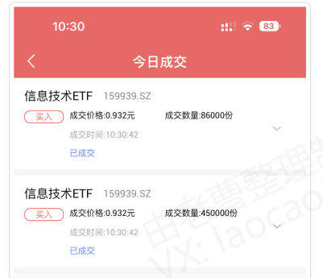

## 2021-04-29 16:14

2013 年 4 月至今的 8 年中，全指信息估值低于目前的只有 2018 年 8-2019 年 2 月这 7 个月。
所以也许还会跌，但你心里清楚这个地方你没有高位接盘就够了。
你敢跌，我就敢接。[微笑] 跌吧。

## 2021-09-29 16:12

下阶段布局目标：
医药、信息。
希望它们不要不识抬举，好好给我跌。
医药好价：12000 点。
信息好价：5000-5400 点。
非历史好价，但低于去年双十一，刚需可入。

## 2021-09-29 16:15

ETF 拯救世界 : 历史低价信息 4300，医药 9500。可梭哈一把配满。
ETF 拯救世界 : 这些价格都会随着时间推移慢慢上移。会及时更新。

## 2022-04-11 13:13

ETF 拯救世界: 7 个月前给的价位。信息从 4300 上调到 4500。该位置配满信息科技仓位。一切尽在掌握。

## 2022-04-26 15:17

关于信息，多说两句。
我的信息走势模型，曾经有两次没有撑住，又下跌了 20%左右。
一次是 2008 年金融危机大底部，两年后自底部涨了 328%。
一次是 2012 年底，两年半后自底部涨了 546%。
这个品种弹性是真的大，目前看也在模型支撑位。但要做好足够的心理建设，撑不住也是发生过
两次的。
2018 年撑住了，涨了 100%多。
基本就是这样了。

## 2022-10-10 10:34

继续致敬。
今天是信息。
只是我自己的操作，非推荐。因为之前说了，就贴出来，免得有人说我嘴炮。
不要乱跟，你也不知道我买了多少仓位。会跌很惨，不要乱跟。

## 2023-03-23 11:00

兄弟先走一部分。
