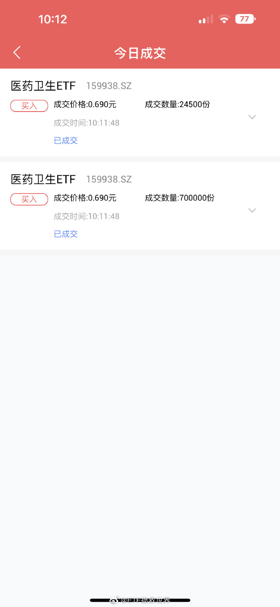

## 2019-04-09 21:39

全指医药上一波在 10000 点是 2015 年 3 月，那时候估值 62 倍。四年过去，指数没变，估值降至 36。
而十三年前的 2006 年 6 月估值也是 36 倍，当时点位是 1407 点，十三年上涨 620%，年化接近 17%。
这就是长期指数投资能够赚钱的秘密。

## 2018/5/7

全指医药卖出点在 14000，每年上升 900 点。

## 2018-06-05 10:01

立个 flag，医药我不会卖的。
13000 之前,或者 12500......

## 2018-10-16 15:32

医药指数 2004 年以来估值最低。 同时碰到了 7800 我的心理预期位。 从今天起，支撑和估值对医药已经无效了。只剩下情绪了。

## 2019-11-22 10:54

医药第一支撑 9850，第二支撑 9550。先看看能否撑住吧。

## 2019-11-22 10:58

医药分为两个区域。
第一个区域是 8500 左右-10450 左右。这个区域是相对低估区域，也是熊市区域。
10450-15000 左右，已经不是相对低估区域。也是牛市运行区域。
这三个数字会随着时间推移逐渐增加。

## 2020-07-13 11:26

医药基本已经脱离我能理解的范畴，进入“外太空”区域。
在这个区域，我将用新的交易策略处理剩下的仓位。
踏踏实实的。

## 2020-09-09 09:55

医药下方重要支撑线是 12000 点。上方压力线依然是 15500。一切尽在掌握。

## 2020-12-01 10:06

医药最下面的两根支撑分别是 10500 和 9000。
无论是什么策略投资，请做好跌幅在 25%和 35%，最多到 50%的心理准备。

## 2020-12-09 13:55

医药上次的网格买入点这次指导意义不强。有两种情况。
第一是由于支撑点上移，到达难度比上次大。也就是说，有可能跌不到上次买入的位置。
第二，如果真的到了，那么跌破的可能性较大。而且，会大概率继续下跌。也就是说，如果跌到了，那么大概率不会像上次一样撑住。
当然，撑不住是好事，就有机会继续第二网买入，未来也就会赚更多。
我就是在这里提前打个心态疫苗。真发生了不要乱。

## 2021-04-26 10:32

医药即将再次碰到 16100 高位压力线。

## 2021-08-17 14:02

好吧，给想买医药的朋友说个我自己准备加仓的点位。
12600-12900 或者 13000 之间。

ETF 拯救世界 : 这个区间是第一个支撑位。下面包括这个支撑位还有三个支撑位，最低支撑位是 9400-9500 左右，最低的这个位置是五年一遇的大机会。

## 2021-09-02 18:14

小预告：
如果全指医药能够到 11700 左右，将进行一次较大力度的买入。
比较强的支撑。

## 2021-09-29 16:12

下阶段布局目标：
医药、信息。
希望它们不要不识抬举，好好给我跌。
医药好价：12000 点。
信息好价：5000-5400 点。
非历史好价，但低于去年双十一，刚需可入。

## 2021-09-29 16:15

ETF 拯救世界 : 历史低价信息 4300，医药 9500。可梭哈一把配满。
ETF 拯救世界 : 这些价格都会随着时间推移慢慢上移。会及时更新。

## 2022-02-08 11:23

医药则不同，其依然完美运行于我定义的正常区间。不信你去看看 20 年我对医药定义的外太空区域是哪里，再看看它最高点是哪里。已经不能用完美来形容。
医药现在已经身在价值区域，注意，我说的是医药，不是医疗。
9500-10000，是医药极佳的长线建仓点位。无论到时候它的利空有多么猛烈，有多少人又想救我一命。

## 2022-02-11 10:09

全指医药历史上曾四次进入目前的区域。
这四次在刚进入时候买入，回本时间为 1-1.5 年之间。
回本后的走势自己去看。分别是：
06 年 3 月，09 年 3 月，13 年 1 月，19 年 9 月。

## 2022-02-11 10:20

我还有个判断，
如果没有外力干扰，医药在 2022 年 7 月底前大概率会见到最低点。
最低点不是说一定会开始大涨，也许还会横盘，但最低点应该是在这半年内出现了。
再具体点，可能是 3-7 月之间。

## 2022-04-13 10:18

随着时间的推移，医药指数左侧买入完毕点位上移至 9600。不玩虚头巴脑，明牌。

## 2022-06-13 14:47

医药大级别支撑已经上移至 9600。
反正事情就是这么个事情。
不跌，震荡，底部就会逐渐抬高。
正常的指数就会这样，越来越高。顶，底，都是如此。

## 2022-09-23 10:13

先小小的表达一下敬意。
更大的致敬等医疗归位。
说到做到，瑞思拜。
（这是我自己的操作，不代表任何投资建议。你也不知道这是我的多少仓位，不要脑袋发热乱跟。）

## 2022-09-27 14:21

有人问 YY 致敬仓位什么时候卖。
我给几个点位，具体怎么卖到时候我也会善始善终说清楚。
第一，12300 附近。
第二，13500 附近。
第三，17300 附近。
以上点位随时间推移会有增加。
我从来不怕提前几个月甚至几年说出几年后的操作，我们一起看看我会不会食言。
知行合一。
