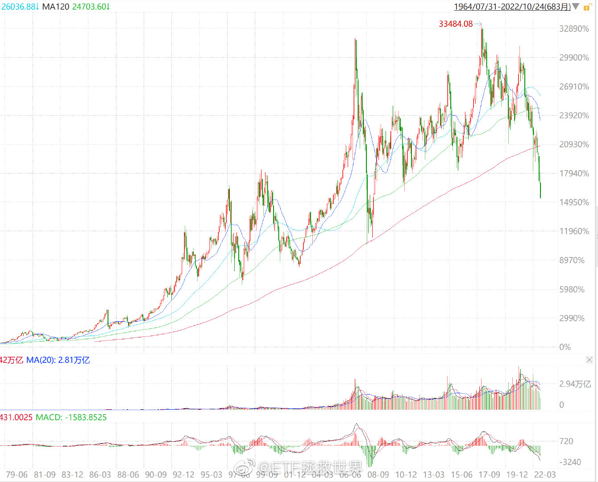

## 2019-07-31 09:47

> $恒生指数 hkHSI$ 下一个世纪最佳加仓点在 21000。如果有危机就能到。

## 2019-08-05 11:01

> 未来我们买恒生的几个关键点位：

- 3000
- 21000
- 17000  
  随时间增加。

## 2019-08-26 10:08

> 预告一下。
> 150 会在 23000 以下买 1-4 份恒生。21000 以下买 4-10 份。
> S 会在 23000 以下持续买入。

补充评论： 再给一个点位。如果真的搞大，让恒生崩到 21000 以下，是非常非常好的买入机会。我给个极限点位 17000。万一真的到了，一把配满恒生指数，从
那里算，不赚 60 个巴仙不再看。

## 2019-09-09 23:57

> 送个贴士给你们：
> 如果你看到某人因为某个品种骂我或者嘲笑我，
> 那么那个品种极大概率已经是底部区域了。
> 根据过去几年的观察，这个策略成功率大概 86 个巴仙。
> 如果是大 v 骂我，则成功率上升至 98.385 个巴仙。

## 2021-01-15 10:45

> 恒生开始挑战第一压力位 29200。

## 2021-01-19 10:22

> 如果能够站稳，第二压力位是 31400 左右。再往上就进入可减仓区域。

## 2021-01-20 10:11

> 新高不卖也适用于恒生。

## 2021-01-21 10:24

> 恒指突破 3 万点。  
> 第一次突破是 2007 年。  
> 那一年，是第一次出现基金发行配售的年份。  
> 有几只当时配售的 QDII 基金这两年收益终于转正了。

## 2021-02-17 16:45

> 2019 年确认的关键点位 21000 点，在 2020 年 3 月暴跌中最低是 21139，就差了 139 点。谁说技术
> 分析没有用，只能说他不懂。

## 2021-02-17 16:48

> ETF 拯救世界 : 下一个压力位是 31400，近在咫尺。31400 以上是可减持区域

## 2021-11-29 12:08 来自 微博 weibo.com

恒生接下来的支撑位在 21500 左右。这是倒数第二个支撑。
最后一根支撑在 18500 左右。如果我是那种轻仓但是想买一部分恒生的，我可能会认为这个位置是极佳的买入位。

## 2021-12-20 11:59

第一支撑调整到 22000 左右，第二依然是 18500。在这两个支撑附近都会买。

## 2022-02-24 11:19

恒生 18500-22000 之间会买 5-6 份以上。别忘了攒钱。

ETF 拯救世界 : 18500，十年之内一两次的那种投资机会。

## 2022-03-04 10:16

恒生指数是一个非常规律的指数。
目前的点位，大概是 3-5 年就会回归的一个位置。而 18500，是 5-15 年会回归的点位。
至于说这次会不会与以往不同，18500 也撑不住。当然有可能，地球明天可能被外星人侵略呢。
有可能是有可能，但我依然会把 18500 这个位置当做一个特别好的买入点。错了的话会赔钱，但
它大概率不会死吧，那就能涨回去。
所以没有在怕的。

## 2022-03-08 16:25

恒生估值没起来过，但是价格可是上下翻飞。我立个 Flag，恒生 18500 如果
有幸买到，不到 30000 点我不会卖。

## 2022-03-08 16:41

恒生已经马上跌破 10 倍估值了。
过去 20 多年，只要破 10 倍就进钻石坑。
我不知道能不能到 18500，但只要不出天大的事，比如大战，比如被联合制裁，那么，现在离底
部绝不远了。

补充：这里说明一下，最近重新整理了过去十年恒生的数据，发现源数据中有一些数
据被污染了。清洗后目前恒生估值没有 11 倍那么低，大概是 13 倍左右，也已经是非常非常低了，尤
其是在近几年加入大量科技股票后。18500 的操作逻辑没有变，我的加仓策略也没变。

## 2022-04-05 13:23

趁着 A 股不开盘，恒生指数偷袭到了 22500，超过了 22000。
几个月甚至更久之前我就已经把恒生的几个关键点位明牌放出来了。
18500 不用说，致敬底。致敬不解释。
18500-22000 点，港股价值区域。
如果能有效突破 22000，那么 25000 将是下一个关键压力位。
再下一个关键压力位，则是 30000 点——那将是致敬仓位的出货区域。
再往上，则是 32500 左右，是 150、S 等长期指数卖出大部分仓位的点位。如果再涨，就到了外太
空，无法再判断。
你现在觉得 32500 是个笑话，因为半个月前你刚刚在 18500 听说恒生已经边缘化。然而未来有一
天到了 32500，就又会有一帮人叫嚣着南下抢夺定价权……
世事轮回，无非如此。观察人性，资本市场是个极好的地方。

## 2022-10-13 16:15

恒生指数技术上没什么好说了，已经跌破最后的支撑。
估值上看，即将到达 2008 年金融危机的位置。
与目前近似的估值，出现在 2011-9；2016-2。
两年前恒生指数到达历史最高区域将近 30 倍，目前只有 10 倍出头。
没有任何投资建议，只是客观陈述事实。

## 2022-10-24 11:45

关于港股“长期下跌”
下图恒生自 1979 年至今的走势。
2018 年创了历史新高，2021 年，也就是去年，差点再创历史新高。
到现在，只跌了一年而已。
不知道长期下跌之说从何而来。
可以看到，恒生的历史特点就是波动极大，非常大，特别大。97 金融危机，00 科网泡沫，07 次
贷危机、11 欧债、15 股灾、20 股灾，每次出事它都会暴跌。然后起来，然后新高。
（注意，恒生指数不含股息。加上股息涨幅会大很多）
很多人说的“长期”，短则三个月，长则一年。再长就不会看了。
当然，这次与以往不同的是，技术上已经完全没有支撑。看看会发生什么。
我依然按照各个策略操作，该买就买，该卖就卖。主动加仓不会了。最后一次主动加仓就是大支
撑的致敬买入。

## 2022-11-15 15:02

恒生指数准备碰历史最后支撑位了。  
是不是很奇怪，涨了那么多，上面碰到的居然是最低的支撑位。  
是的，很可笑，30 年支撑跌破了一个多月。  
你问我为什么不在下面重新设支撑，不好意思，我不知道怎么设置。因为 9 月底到现在的恒生是无法用历史来解释的。  
你又问我，所有的支撑在上方的时候都是压力，那么这个支撑是不是恒指的压力。  
我也不知道。因为历史没发生过跌破最后支撑的情况，那么它会不会变成压力，我蒙圈了。  
交给市场吧，看它怎么走。  
但我可以告诉你正常情况下第一个压力位是哪里，很久之前开始说过好几次了：  
22400 左右。  
就是上次碰到跌回来的那个地方。

## 2023-01-26 11:58

如果恒生指数能够有效突破 22500 并站稳，那么上方压力位就在 25500 左右。
在那里，致敬仓位将继续卖掉 30%。
你看，我的所有买入，卖出计划都是命中注定，不是拍脑袋，更不是情绪决定。
交易是一件很有乐趣的事情。最大的乐趣就是预期照进现实，现实实现计划。
