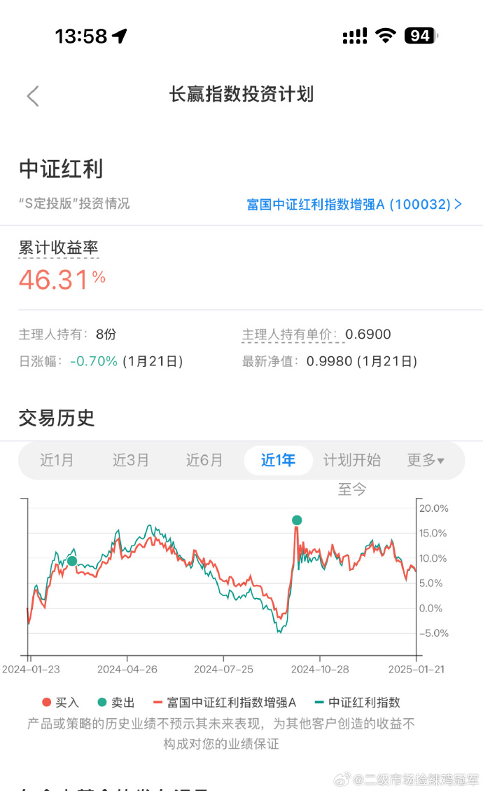

##

红利 2015 年相同净值的时候估值 28 倍，现在只有 13 倍。我真不明白这样的指数为什么前一段时间被那些人呢喷那么惨。就因为近一年表现一
般？

## 25-1-22 13:01 https://weibo.com/7519797263/PaK0U1ZJG

中证红利（000922）技术方面以今天点位看，4650-4750 区域是不错的补仓位置。

我们的长期计划也有可能将之前高位卖掉的部分买回来，也有可能不买，到时候再看。

价值方面的点位是否一致，这个需要到时候再看，应该不会有太多差距。

我不怕打脸，一直是提前几个月坦坦荡荡给明牌，给详细操作。 ​​​

https://wx4.sinaimg.cn/mw690/008cUiMDgy1hxtgadnl1mj310o1nxjzj.jpg

## 2021-01-28 18:37

再说个具体的指数。比如中证红利。很多朋友觉得涨的少，不喜欢。但我不知道有多喜欢。目前
它的估值与 2018.06 也基本一致，pb 已经进入历史最低 5%。但是注意，红利全收益指数从当时
的 6101 涨到了现在的 7262。也就是说，维持着历史最低估值不变，已经多赚了 20%。年化 8%以
上。我可太喜欢了！pb 不到 1.2！

##   2021-05-11 09:25

说点正经的。
我希望各位明白，红利虽然现在每天新高，但并不代表它是最好的、全天候的品种。
实际上也没什么全天候的好品种，每个品种一定都有自己的高光和至暗时刻。
它有自己的特点，比如估值低，比如长期比较稳，比如成长性不行，比如分红高等等。你明白一
个品种的特点，才能通盘考虑，看看怎么利用它的特点为自己的组合发挥更好的作用。
当然，长期看，只有消费和医药两个才是yyds
（wind真是越来越不上心了，几个品种叠加的话图形就会出问题，只能分开展示，服了。）