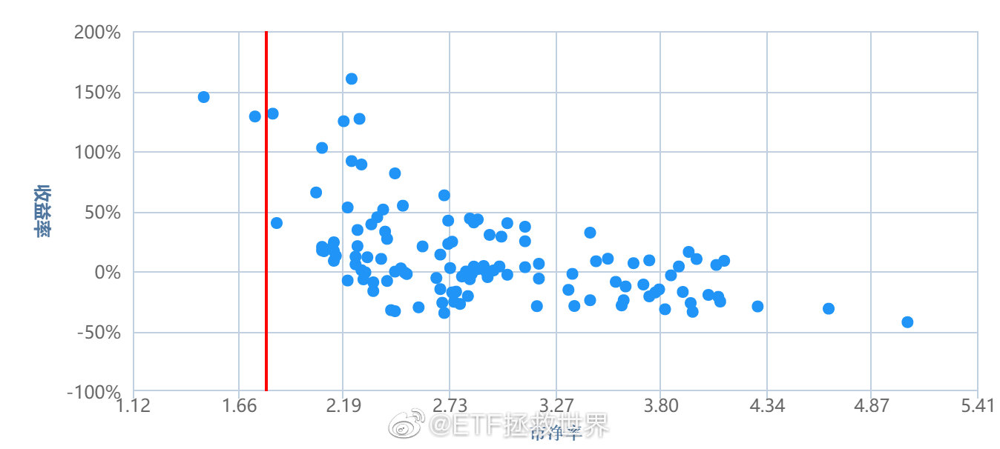

## 2019-01-24

其实金融投资，想要不被骗有几个关键原则稍微把握一下。包括，但不限于：  
第一，正规。一定要正规，法律允许的，zf 保护的。比如沪深交易所，各大期交所的产品。我有朋友玩现货，被卷款跑路。  
第二，你要知道整个产品的原理。如何募资，资金投向，资金监管。比如指数基金最简单了，得到监管层批准的公募基金公司从投资者处募集资金，放在监管银行，以一定规则投向交易所的各种证券品种。整个流程清晰，可控，受到保护。是不是能搞清你的钱是如何运作的，很重要。我估计很多投资 p 的朋友根本不知道自己的钱被用来干嘛了，这个就很麻烦。
另外，尽量避免非常复杂的产品。  
第三，承诺收益过高直接放弃。世界上不存在“绝对无风险”+高收益率的东西。想要高收益率，就要承担高的波动风险。如果有人告诉你，他的产品绝对没有风险，同时有年化 10%以上的收益率，直接转身走人。一定是哪里有大坑等着你。  
第四，只要是正规的产品，不存在卷款跑路的风险，就有研究的价值。只要你杜绝了卷款跑路的风险，剩下的赚钱不赚钱就是你自己的能力问题了。这就不是“骗”的范畴。

没有发生过连续两任监管任期内都没有牛市的。  
这次应该也不会例外。

## 2019-02-01

另外我再跟你们说个一定要注意的，这条一定要收藏。  
就是  
在底部，无论是指数还是个股，跌了很久以后，很多很多时候会爆个特别大的雷。就是雪上加霜那种。  
会让很多本来已经神经衰弱的人最终彻底放弃交出筹码。  
而那天有可能就是  
世纪大底

## 2019-02-11

> 各位可以在网上非常直观的观察到情绪。  
> 我这里来说，第一次是券商见底前一天那哥们粉转黑喷券商。第二次是 10 月见底前一天那哥们清仓。第三次是年前这哥们清仓。
> 什么是情绪，这些就是情绪。
> 我这里还好，理性的人多。（不理性的都看不上我或者都被拉黑了）球球其实是观察情绪最好的地方。因为那里并不是永远完全不理性。而是在极端的时候，非常非常有观察意义。
> 包括对人的追捧和唾弃，包括对品种的追捧和唾弃。真的特别特别的有意义。
> 在资本市场，观察人性是非常有意思的事情。不知道你能不能体会到。

## 2019-02-12

> 一定要让价格远离自己的成本区。否则你总是处在盈亏边缘，这对你的心理或者整个体系都是极为不利的。  
> 至于如何让价格远离成本区，可以先思考一下。

_(网友）叫我毛毛哥: 我能想到的几点：1 尽量低估买入 2 网格交易 3 有合适的机会做 t 4 在绝对低估的时候超配，在上涨到压力位减持到标配，这样成本下降不少。_

## 2019-02-19 19:17

> 每个人操作模式不同，适合自己的策略也不同，买卖都很正常。市场怎么可能只有一种模式呢。  
> 我不鄙视跟我不同的，但你真没必要跟我说你怎么操作的。为了以后低位接回来显得自己牛吗？  
> 不可能的，只要有点常识的人都知道，今天卖了，明天低位买回来没什么了不起。除非你能连续赢 100 次。  
> 连续赢 100 次也说明不了什么。做个游戏，你找 1000 个人，每天一半人猜涨，另一半猜跌。最终会有一个把把连胜的人出现。问题来了，他是猜涨跌大神吗。  
> 网络世界就是这样。总有牛人冒出来。为什么，因为基数太大了。总有人能在某段时间表现特别好。  
> 比如你去查查每年私募第一名的收益率，能吓死你。  
> 但问题是，能持续吗？还是去看冠军私募第二年的成绩，你就懂了。
> 很多人会混淆运气和能力的概念。这个各位真的要仔细思考。

_公募基金也是这样_

ETF 拯救世界（E 大评论）: 表现最好的一定是非常激进的。激进的在风口会特别好，一旦出问题就是灭顶之灾。所以尽量不要碰短期最好的。长期在前列，能力强的概率大点

## 2019-02-21 11:42

> 很多人 2500 点看着自己的账户痛不欲生，看一次心里颤抖一次。只希望历史重演，自己从没开过户，从没买过。  
> 2700 多又觉得买少了，拼命想加仓。  
> 说的是不是你，自己检讨一下。

_太生动形象了……_

ETF 拯救世界（E 大评论）: 有这种感觉的朋友，请记住 2700 你的感觉，你的心情，你的想法。未来如果再次跌回去，请不要再害怕。再说一次，你买的是指数，只要买的不高，就极大极大概率涨起来。你的所有担心都毫无必要。现在再体会一下。你已经有经验了。

> vior 女神: 其实我是等跌的。我以为会破 2440。心想既然要跌到 2440 我何必现在买那么多呢，当时是 2530 点左右。。。。
> ETF 拯救世界 : 那 3.6%下跌真的对你那么重要？真的吗？

评论：不能为了极值，放弃 90%上涨的概率。应该是 E 大在其他地方说过的。

## 2019-02-22 11:22

> 再说一个：  
> “券商之所以每次牛市都是反弹利器，并不是因为它本身的原因。而是因为大家都认为它是反弹利器。所以即使知道最后还会挂，依然会往上干”——E 首发。

## 2019-02-25 15:32

我再提醒一下。
之前低位很多人不敢大力投入。涨起来了加大资金，补仓提醒会给你补仓建议，但你已经失去了低位筹码，未来如果赚不到钱不要埋怨我。
我还是那个建议：整体亏损再加钱。否则你越涨投的越多，神仙也救不了你。

_问：什么样的情况下可以调大 150 份每份的金额_
_答：整体亏损的时候_

## 2019-03-01 16:46

> 从数据看，本次进入钻石坑是十月，二月出坑，持续四个月。
> 基本与历次熊市大坑持续时间差不多。
> 历史上还没出现过出坑后马上又跌回去的情况，这次能不能出现？自行判断吧。

## 2019-03-05 15:45

> 说真的，在股市有没有赚过大钱，不用多，你看他的言论一周或者半个月就明白了。
> 我很想系统总结一下真正赚过大钱和没赚过大钱只是因为能写字变成炒股界知名人士的特征。
> 但想了想，还是不写了。
> 太得罪人了。
> 但是大的点我可以说三个：
> 第一，历史顶部区域知道撤退。你别管走的早了点还是走的稍微晚了点，只要顶部区域退了，就是 1/3 牛人。
> 第二，历史底部区域进场。你也别管进了早了点还是晚了点，别管他是右侧还是左侧选手。只要底部区域进来就行。做到了，2/3 牛人。
> 第三，拿到筹码后上涨趋势中是否坚定持有。可以小幅调仓，可以换仓，但大仓位一定是坚定持有。做不到这点的，有可能不赔钱，但 99%没赚过大钱。
> 以上三点做到，80%牛人。每次牛熊都做到，95%牛人。
> 其他的都是嘴炮。真的。
> 嘴炮的东西少看。我说一万次了。那是噪音。噪音不仅会耽误你的时间，还会让你赔钱和赚不到钱。当然，这也不赖人家，人家只是说自己的观点，你愿意信。但是还是少看为妙。真的对你一点点好处都没有。
> 另外，不要再问我：谁谁谁说什么了，你怎么认为。
> 我一点都不关心谁谁谁说什么了。这不是因为我特别傲慢，而是因为上面的原因，我不能去看那些噪音。对我自己没好处。我不能让噪音影响我。有关注价值的人，我已经关注了，没有关注
> 的，我也不想去了解。我没有时间，没有精力，没有意愿去听噪音。
> 你愿意听，你去听。别把噪音传给我。另外，你也不要做噪音源，不要告诉我你怎么操作的。我同样不关心。我只关心我自己下一步该怎么做。

## 2019-03-06 14:12

我持有的一只打新门票股从最低位涨上来 130%了。
整个下跌过程中我坚持不懈的 369 补仓。
终于回本了。[微笑]
从第一次买到最低点跌了 74%……而我第一次买的时候已经从最高点跌了 45%了……
股票这玩意真神奇啊。
（我本人所有打新门票仓位加起来大概十几个点。目前持有 40 多只。）

西九湾仔 : 定额补仓策略，在跌了 30%、60%、90%的时候分别买入等额资金的股票，摊薄成本，缩短回本所需的涨幅

## 2019-03-11 14:43 资产配置

> 再说句你不信的。你这 70%A 股仓位+10%港股仓位+10%其它乱七八糟的组合，一轮行情下来跑赢 90%经常满仓经常上蹿下跳经常追涨停板的人。  
> 信不信由你。  
> 最关键的是，你回撤还小。你说是不是见鬼了。

## 2019-03-23 20:34

> 子夜时想: 买着指数睡的稳吃的好一天不看也没事，买了个股在这样的暴涨行情中不看盘是不可能的，看了盘你管的住自己的手吗？管不了下场就是亏！

ETF 拯救世界 : 主要是不踏实。我把大部分资产闭着眼睛买入指数基金一点都不担心，但你要让我哪怕只 10%资产买入某个股票我真的不踏实。即使是目前如日中天的所谓“蓝筹股”。世事难料。

## 2019-03-29 10:32

为什么我只敢买交易所的标准化产品，而且是不死的那种。  
很简单。  
其它品种投少了，改变不了什么，没有意义。投多了，风险太大。辛辛苦苦攒了十几年的钱瞬间就没了，这个我接受不了。  
还是指数基金适合我。除非所有持有的 1000 家公司同时崩盘，除非交易所关门，否则就死不了。  
死不了就有办法挣钱。

## 2019-03-31 21:23

> 那些等着经济走好再投资的人，终于等到数据走好了，股市却已经涨了三五十。
> 这话去年底我说，你可能不信。现在有没有一点理解了？
> 事情都变好再投资，凭什么你赚钱？凭什么啊。

> 补充评论：股票市场绝大多数时间是先行指标。对于经济最敏感的是债市，其次就是股市。

## 2019-04-16 16:54

我能看出，很多朋友投资经常陷入的一个误区就是：
这个东西没有长期投资价值，或者长期投资价值很低，为什么要买它？我就不买。
投资品种有两类，一个叫做有长期投资价值，一个叫做有中短期交易价值。
很多“价投”只买前者，很多短线客只做后者。
我不这么做。小孩子才选择，成年人都要。
很多品种长期看确实价值一般，但我并不想长期拿，我只吃它上涨的这一段。你非要跟我说——它长期不行，不行不行。这就有点鸡同鸭讲了。
所谓长期投资好像听起来要比短期投资高大上？这就是又有了执念。
哪里有机会，哪里能赚钱，哪里就应该有你的身影。至于长期短期，并不是最重要的。该长期持有的好东西就踏踏实实拿着，该做波段那就吃完就走。
千万别把自己局限起来。任何事情都是如此。

## 2019-04-17 16:48

目前 A 股收益率再次低于十年国债收益率。
本次股票收益率高于国债收益率周期为 7 个月，与 2005、2008、2012 三次大底持续的时间基本相同。

## 2019-04-18 18:46

给各位一个数值：
5%。
如果一个品种在你的配置中超过 5%，就可以影响你的组合净值了。不到 5%很难影响。
记住这个数字，并应用它。

个人评论：150 份的话，5%是 7.5 份。所以看看哪些买够 7 份了的。

## 2019-05-07 10:39

观察一个投资者的水平，很大程度上你要观察它在某个品种暴涨之后和暴跌之后的态度。
如果一个品种短期暴涨后，他依然在给暴涨找理由，告诉你还能涨 10 倍，现在还很便宜，赶紧买；
一个品种暴跌后，他头头是道分析半天，告诉你赶紧卖这东西不行，完蛋了。
我不能说他一定是水货，但如果这样的次数多了，对他的水平你就要产生一些疑问。
另外有一点你需要注意。
有些人写字，是，我写我自己的想法，有人看当然好，没人看也无所谓。
有些人写字就是为了让更多人看，为了实现这个目的，会不择手段吸引注意力。有了注意力，就有了生意。

## 019-05-07 11:29

无论是买卖，你都最好有个理由。
什么理由都可以，只要是客观的，最好是可量化的。
“我觉得可以买/卖了”可不算。

## 2019-05-07 17:44

对喜欢看指数 PE 以及 PE 百分位的朋友，我不管你是从哪儿看，我给你一条贴士：
看 PE 的时候，同时观察 PB、PS、PCF 和股息率及它们的百分位。
你只看一个数据，港真有点 naive。更何况有的数据错到离谱。错的原因不是计算错误，而是计算数据的人没有想清楚自己到底想得到的真相应该怎样获
得。一句话形容，就叫做照本宣科，书读死了。
观察这个世界，要从不同角度全面观察，然后综合考虑。千万不要盲人摸象，更不要让盲人摸完了再告诉你。

## 2019-05-07 17:55

也不要神化数据。数据只是代表一个概率。学会识别数据，只能让你的长期胜率增大，但不能保证你必胜，也不能保证你短期就一定赢。
认识世界要多维性的认识。从各个角度观察，然后将每个角度的概率综合，再去做出判断。
不要禁锢自己的思维，不断学习，不断扩展观察世界的角度，胜率才会增加。
当然，这个过程中，增加角度的时候也要学会抛弃。变量多了，有时候出错的概率反而更大。
总之就是要不断进化，尽可能完善自己的观察系统和交易系统，提高胜率。

## 2019-05-14 05:40

美股一般情况自最高点调整幅度最多 20%-30%。碰到经济危机会超过 40%。
这里是让大家先有个概念。

## 2019-05-20 11:02

再说一次，手里有钱不是你投资的理由。

好机会才是。

## 2019-05-23 21:38

我不知道你相不相信历史数据。
即使不信，参考一下也好。
当然，历史未必等于未来。然而我愿意给你下面这几个数据，让你有个参考。
下面几张图，是中证 500 的 PB/股息率/PS/PCF 对应的未来一年收益率。纵轴是收益率，横轴是各项数据。
怎么看呢。很简单，就是当 500 的各项数据在某个数值的时候买入，可以看到持有整整一年后，收益率是多少。
这种图，散点越规则就越有效。比如 PB 越低，收益率越高。PB 越高，收益率越低。然后散点都是按照这个规则形态分布，那就非常有效。
接下来，好好看看吧。红线是目前位置。你可以看看，这个位置买，一年至少会涨多少。说实话，我都有点怀疑这么高历史还会重演吗。
记住今天，2019 年 5 月 23 日。
2020 年 5 月 23 日我会把这个帖子翻出来。咱们一起看看结果如何。
（这么好的帖子你居然不打赏？）
（我看评论有人说看不懂？很简单啊。比如第一张 PB。目前红线周围有三个点，分别对应 130%和 45%左右的纵轴。说明历史上有过三个月与目前 PB 相
同。那三个月买入，两次一年收益率 130%，一次 45%啊。）

## 2019-06-18 09:37

仓位合适是什么感觉，我告诉你。
就是
啊啊啊，涨了涨了，好棒啊哈哈哈
哎呦我去，怎么跌了！太好了哈哈哈
就是这样。
发车了都你还在这里刷微博？

##  2019-05-07 17:44

对喜欢看指数PE以及PE百分位的朋友，我不管你是从哪儿看，我给你一条贴士：
看PE的时候，同时观察PB、PS、PCF和股息率及它们的百分位。
你只看一个数据，港真有点naive。更何况有的数据错到离谱。错的原因不是计算错误，而是计算数据的人没有想清楚自己到底想得到的真相应该怎样获
得。一句话形容，就叫做照本宣科，书读死了。
观察这个世界，要从不同角度全面观察，然后综合考虑。千万不要盲人摸象，更不要让盲人摸完了再告诉你。

##  2019-05-07 17:55

也不要神化数据。数据只是代表一个概率。学会识别数据，只能让你的长期胜率增大，但不能保证你必胜，也不能保证你短期就一定赢。
认识世界要多维性的认识。从各个角度观察，然后将每个角度的概率综合，再去做出判断。
不要禁锢自己的思维，不断学习，不断扩展观察世界的角度，胜率才会增加。
当然，这个过程中，增加角度的时候也要学会抛弃。变量多了，有时候出错的概率反而更大。
总之就是要不断进化，尽可能完善自己的观察系统和交易系统，提高胜率。

##  2019-08-02 08:56

趋势不好，仓位合适，可以做的就是控制节奏，不要买太多。
你观察这几个月150计划怎么做的就知道。大底以来几个月只买了一两份A股指数，德国、黄金、海外互联买一点。转债多买了几份，防守性能比指数强。
我相信有机会把所有资金买下去，也有机会把组合里的防守品种换成进攻的。不急，控制节奏，趋势向下，机会很多很多。
投资其实你认真想一想，就那么几件事：估值、趋势、情绪、周期、流动性。掰开了揉碎了，没什么更多新鲜的。
至于一些具体事件，只是催化剂而已。

##   2019-08-05 11:07 

对于新高的品种，不要随意预测它什么时候到顶。
新低的品种也是。
不过新低与新高不同，只要这个品种不会死，那么它的低就会有限。
而新高是无限的。
根据这些特性，制定交易策略。   

##  2019-08-08 09:21

伯克希尔现金储备创下1220亿美元新高
现金从来不是辣鸡。

##  2019-08-14 08:39 

之前一直说的，右侧只有两个买点：突破和回踩，就是防止追高出现昨天黄金这种冲高回落走势。
一个品种在上升趋势，你买进去大概率当然是赚。但也随时就是套在最高。最稳妥的办法就是突破以及回踩的时候买，再之后怎么涨都不动心。
赚钱固然重要，安全才是第一。没有100%的安全，但要尽可能低成本持有。

##  2019-08-15 10:09

指数投资与股票投资最大的不同，是有一个大致可估算的区间。
无论你从价格也好，价值也好，都会找到一个模糊的顶和模糊的底。不会很精确，但控制在十几个点之内是没问题的。
比如之前说的下跌80%原则，就是价格区间。比如钻石坑或者哈迪斯顶，就是价值原则。
知道了顶和底，你就可以开心的设计你的策略了。如果你知道它极大概率不会跌破某个价格，你就可以以那个价位为底，设计一整套或者几套长期或者短期
交易的策略。
尤其妙的地方，是你可以写好表格，将每个价位你有多少仓位你该买还是卖持有了多少亏损多少盈利多少事先全部列出来。你说，你已经提前列出来未来各
种可能，那么这些可能发生的时候，你还会有任何情绪波动吗？
不会的。你不会有任何情绪波动。你只会按照当初的设计，打开软件交易而已。

##   2019-08-15 10:16

“心情”是金融投资中最最最不可靠的东西。
觉得可以买了，觉得应该卖了。看了个新闻或者报告觉得要涨了或者要跌了然后交易，都是最危险的。
设计交易策略，然后执行它。效果不好就改进，然后继续执行。

##  2019-12-11 10:00

网格是做网格，再提醒一次，这是整个体系的一部分，是为了应对震荡市。
这个策略，在震荡市光辉无比，在大牛市会变成渣。所以2.0的很多细节要注意。比如卖的时候留利润等等。
让自己低成本、0成本，甚至负成本的筹码越积越多，才是未来赚大钱的基础。   

个人评论：是不是需要留一个底仓数的部分。