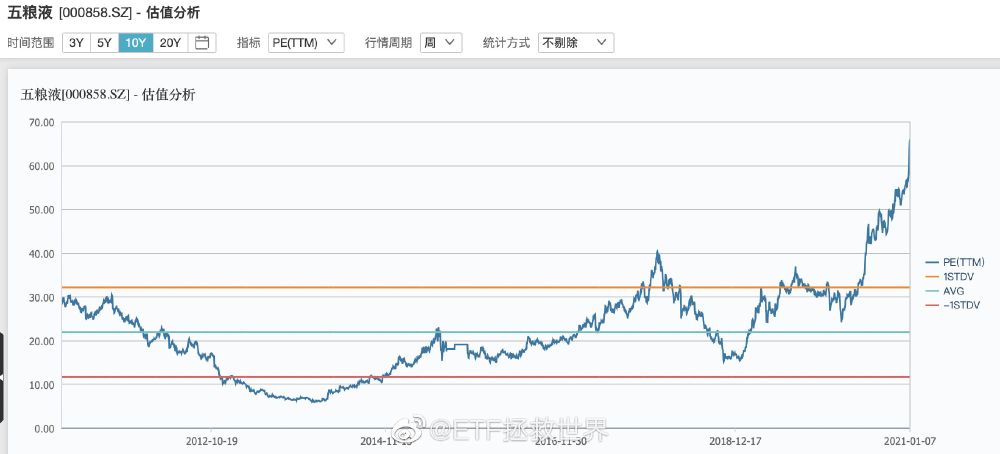

## 2021-01-06 10:42

两融余额目前 16556 亿，再创 2015 年 7 月以来新高。  
历史两融余额最高位在 2015 年 6 月，数字是 22000 亿。  
历史首次突破 16556 亿是在 2015 年 4 月。两个月后，也就是两融余额顶点的时候，A 股爆破，烟花灿烂。  
基本上两融余额等于融资余额。融券额非常少。目前融资额是 15111。也就是说，有 1.5 万亿的合法杠杆资金在场内干。  
2015 年后，两融余额最低点是 7100 亿。知道什么时候吗——2019 年 2 月，钻石坑边缘。  
这些数据不代表任何看法，只是罗列事实，不要过度解读。

## 2021-01-08 09:27

白酒记录：
估值：五粮液为例，估值已经从 2013 年的不到 10 倍，飙涨至十年最高的 66 倍。目前市值 1.28 万
亿，2019 年利润 200 亿。
从 20 年周期看，未到最高。最夸张的是 2007 年的 125 倍+
情绪：之前评论中非常多的朋友谈到自己的同事/朋友/同学都追了白酒基金赚了很多钱，并表
示“白酒永远涨”。
没有主观判断，只是客观记录资本市场。

## 2021-01-14 09:54

从最高位下跌 5%的时候卖出有人嘲笑是“低位卖出”，  
跌到 10%的时候他会回来道歉吗

## 2021-01-15 08:55

不要嘲笑基金报团。  
你基民就喜欢买短期猛的基金，稍微弱一点你就骂，你让基金怎么办。基金公司头部效应越来越明显，绝大多数资金都会集中到几家大公司，公司不出爆款基金怎么吸引资金。

没办法，知道贵也得买也得冲，被逼的。

## 2021-01-15 10:15

什么是情绪呢，怎么监控呢。

其中有一点就是你要监控旅鼠们有没有给某个板块起一些恶俗的绰号：  
比如“大烂臭”，比如“三傻”  
这些绰号出现后，你就应该知道有些事情可能要起变化了。  
首先是说明这些品种涨不动不让人喜欢，  
更重要的是这些绰号真的恶俗到极致，让人看了就感到恶心，除了那些品味极差的人是起不出这样的名字的。这些人能有什么高明的眼光确实值得怀疑。

## 2021-01-25 09:44

这几天跟一些机构的朋友沟通了一些数据。
我没法给你非常精确的数据，但我能告诉你的是，去年不仅股民整体没怎么赚钱（涨幅中位数
2%），涨幅巨大的基金持有者收益率也远小于你的想象。
有些过去两年翻番的基金，其持有者的平均收益率只有 30%多。
随着行情继续向上，新基民的大量涌入，老基民的不断加仓，平均收益率会越来越低。最终只要
市场有一个十几二十几个点的波动，就会大面积亏损。
朋友们，对你的未来投资我只有一条建议：
熊市买入。越跌越买。牛市涨幅巨大后不要追涨。

> E 大评论：持有者收益率低的原因不仅是牛市入场晚。还有一个原因是持有时间过短，频繁买卖，根本无法
> 享受大涨的收益。基民平均持仓基金时间只有 7 个月。

## 2021-01-27 13:55

很多没有经历过熊市的朋友，他们心中最大的疑问是：
为什么要那么小心的做投资？为什么不满仓干？为什么不追热点？
灵魂三问。
别急，时间会给你答案

## 2021-01-28 18:08

今日数据：
目前全市场估值与 2018 年 6 月相似，已经进入“黄金坑”。
我本人会在这个位置维持一定仓位，不会轻仓。
（没有给你仓位建议的意思，也没有建议你买入或者卖出的意思。只是说明我自己的仓位，求求
你无论涨跌别骂我。）

## 2021-01-28 18:37

再说个具体的指数。比如中证红利。很多朋友觉得涨的少，不喜欢。但我不知道有多喜欢。目前
它的估值与 2018.06 也基本一致，pb 已经进入历史最低 5%。但是注意，红利全收益指数从当时
的 6101 涨到了现在的 7262。也就是说，维持着历史最低估值不变，已经多赚了 20%。年化 8%以
上。我可太喜欢了！pb 不到 1.2！

## 2021-02-04 17:00

> 今天收盘，上证指数 3501 点。  
> 2 年前的 1 月 4 日，上证碰到 2440 点。  
> 那么，当时上市的 3537 只股票中，到今天有多少下跌呢。  
> 答案是 1466 只。占比 41%。  
> 也就是说，有 41%的股票比 2400 点还低。  
> 跌幅最大的股票已经退市了，跌幅大于 60%的有 88 只，跌幅大于 20%的有 759 只。  
> 你永远也不知道这两年很大一部分股民是怎么过的……

> 补充评论：ETF 拯救世界 : 还有一个数据。去年 7 月 20 日至今，有 2811 只股票是下跌的。占比 73%。跌幅 20%以上的股票是 1650，占比 43%。但是，当时是 3300 点。

## 2021-02-05 13:29

投资就像打猎，大多数时间安安静静的等待。等着猎物进入射程。
一枪没打中没关系，继续等。着急乱开枪只会把猎物吓跑，空手回家饿肚子。
有子弹你还怕没猎物？我怕你打光了子弹一回身后面一群狮子老虎大鳄把你拉回去当晚餐了。

## 2021-02-08 10:13

每一个品种在没开始交易之前，都应该预先给它设计好“最大仓位”。
比如你给沪深 300 最大仓位 20%，中证 500 给 20%，医药给 15%，消费给 15%……等等。
然后要设计交易策略。也就是怎么买、怎么持有、怎么卖出。当达到什么样的标准时买入、持
有、卖出。
如果你没有设计最大仓位，没有设计交易策略，就会出现第一笔乱买，第二笔乱补。本来只想买
点玩玩，谁知道补成了重仓。涨了不知道该不该卖，跌了不知道该不该买。乱补仓、乱割肉、乱
追高、乱赔钱。
非常混乱的人生呢。

## 2021-02-10 10:23

泡沫就是要大到所有看空人的脸都被打肿，没有任何人敢再看空，甚至看空人开始怀疑自己而转
身加入泡沫的时候，
才会破灭。

##

原油 30 美元进场抄底，60 美元还没涨回去，这个投资做错了吗。
我复盘了一下。
首先，30 美元买错不错？
我认为没错。30 美元的原油中长期看都是很便宜的底部区域，暴跌后入手没有错。
其次，做反弹思路错不错？
我也认为没错。我的思路就是吃反弹，并没有想长期拿。因为原油期货品种长期看会有损耗，不
适合长期拿。但是短期博反弹没问题。实际上也确实是一个多月就反弹回成本价格以上了。现在
投资标的距离成本价格已经涨了一倍。
那么，哪里出问题了？
出在极端情况下交易品种改变了持仓规则。导致下跌全部吃到，上涨只吃一部分。
那么，这个情况是投资之前可以把握的吗？不可以。当时不会预见到持仓规则变化。
但是，可以预见到的是期货品种会有损耗，所以有可能出现极端情况。那么，既要参与又要防范
产品风险的做法是什么？
小仓位参与。
实际上，我们也确实是小仓位参与，只买了一份原油。之后的套利自救行为不考虑，只说买入行
为。
所以，如果再来一次，我还会这样做。在肉眼可见的低位区域买入，同时控制风险。风险真的出
现后积极通过各种方式自救。
复盘完毕。

## 2021-02-18 14:34

关于网格资金的利用率，我想这一年一直在做的朋友都会有体会。低不低，做了的人才知道。
一个品种的网格，只需要预留一份资金在里面，成交后才会再加下一份的。这个资金没有成交的
话，每天收盘后会自动买入余额理财，目前的年化收益率是 2.5%左右。
也就是说，你运气太差了，一年时间这个品种都没成交，你的收益率是 2.5%。
那么，如果你成交了一笔呢？
你这笔钱的年度收益率就会飙涨至 7%以上。（通常来讲一笔买入后并不需要太久就可以卖出）如
果同一价位成交两次，那么年度收益率就是 11%以上了。
各位可以看看每个品种的历史成交情况，就会发现这个资金利用效率太高了。恒生这样的奇葩品
种可以在一个位置反复吃。你长期持有的部分可能一年下来一分钱没赚，但是网格部分已经吃了
十几二十个点了。
当然，更关键的是心态的调整。从此你不会只盼着涨，你知道跌了你也可以赚钱，波动更能赚
钱，你已经是一个全天候的收割者。
不认真看策略说明，不下场试试，就“觉得”资金浪费了。这恐怕并不足够理性。

## 2021-02-22 14:13

追热门的都是不理性的基民你知道吧。
不理性的基民看到净值持续下跌会赎回的你知道吧。
基民赎回基金经理就要卖出抱团股你知道吧。
基金经理卖出抱团股抱团股下跌净值又会跌你知道吧。
净值又跌了会有更多基民赎回你知道吧。
