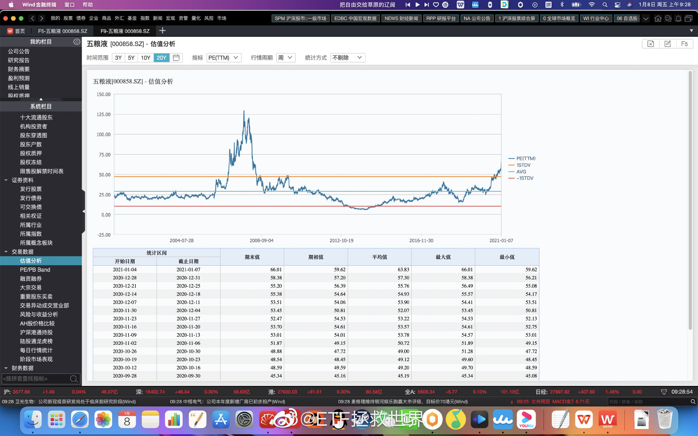

## 2021-01-06 10:42

两融余额目前16556亿，再创2015年7月以来新高。
历史两融余额最高位在2015年6月，数字是22000亿。
历史首次突破16556亿是在2015年4月。两个月后，也就是两融余额顶点的时候，A股爆破，烟
花灿烂。
基本上两融余额等于融资余额。融券额非常少。目前融资额是15111。也就是说，有1.5万亿的合
法杠杆资金在场内干。
2015年后，两融余额最低点是7100亿。知道什么时候吗——2019年2月，钻石坑边缘。
这些数据不代表任何看法，只是罗列事实，不要过度解读。

##  2021-01-08 09:27 

白酒记录：
估值：五粮液为例，估值已经从2013年的不到10倍，飙涨至十年最高的66倍。目前市值1.28万
亿，2019年利润200亿。
从20年周期看，未到最高。最夸张的是2007年的125倍+
情绪：之前评论中非常多的朋友谈到自己的同事/朋友/同学都追了白酒基金赚了很多钱，并表
示“白酒永远涨”。
没有主观判断，只是客观记录资本市场。

