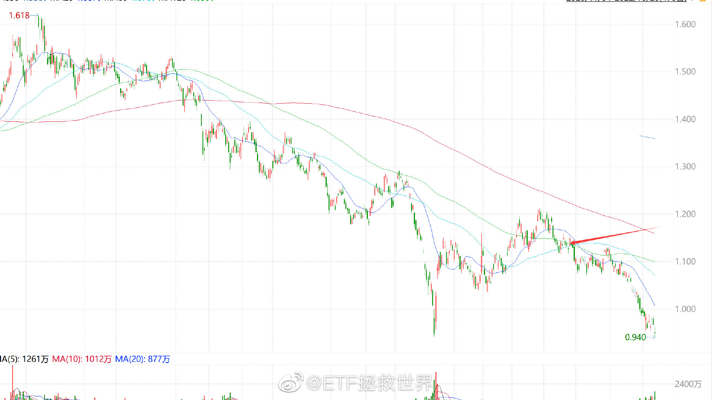

## 2022-01-03 13:37

在连续三年年初蒙对当年行情（19 年各指数大涨；20 年巨幅波动；21 年热门板块跌 30%-50%，
中小股票表现出色）后，
照例又要预测一下今年的大致行情。
当然，事不过三，今年蒙对的难度系数增加了好多，权当一笑吧。
今年的行情会非常复杂，但一句话总结，到年底，大多数指数应该是收阴。
展开说说。
首先按大小分，大指数 21 年表现很不好，22 年表现非常好的可能性很小。即使上涨，幅度也会很有限。
中小股票已经不像去年那样便宜到令人发指了。所以也不要对我们的 500 等品种抱有太大的期望。全年下跌的可能性大于上涨。
热门板块，调整了，但调整的不够。
如果让我判断 2022 年的机会，我反而会说来自于 21 年的弱势品种，比如中概等。
逻辑是这样：
2
自目前的位置，中概如果进一步暴跌，那么即将到达 70-80，也就是未来赚大钱的起点。那将是几年一遇的大机会。
如果不暴跌，只有波动没有涨幅，也完全 ok。因为我们有提款机制。你只管波动好了。
如果上涨，那不用说，我们的持仓等着赚钱就好。
所以今年中概等弱势品种，要么会让我们赚钱，要么会为未来赚大钱打基础。我相当看好。
有朋友问，如果大多数指数今年收阴，为什么不清仓。
下跌或者波动，很多时候不代表没有机会赚钱。我们判断行情，不是为了指挥自己的主动性去操作。比如你悲观了就去减仓清仓，乐观了就加仓满仓，我的投资不是这个逻辑。
我的投资是，根据主观判断，在投资体系中调整主观判断那一部分的因子。怎么理解呢，就是我判断大指数不行，我就减仓，或者不加仓。比如 2021 年，我在年初就判断热门板块很危险，所以卖出 50、300、恒生，之前也卖出中概。我是没有消费，要不然当时也卖出。但我轻易不会清仓，因为要有一个容错空间。比如我年初看好中小，所以一直到下半年，我一分钱 500 也没卖，
但年初也不会加仓，都是一个道理。
主观判断只是权重配置逻辑之一，其它的还包括各种客观分析，这个不多说了。
概括一下：
1、全年看，下跌的品种比上涨的品种多。大多数会下跌。
2、全年看，大指数、调整不充分的热门板块，我依然不看好。我不知道会不会跌，但继续大涨的概率很低。
3、中概等惨烈的品种要么会赚钱，要么就是会提供赚大钱的买入机会。
4、中小指数相对大指数不会再表现像 21 年这么好。因为已经非常鸡肋。
5、22 年会非常非常难做。因为年中的波动会非常怪异，远超绝大多数人的想象。如果 21 年没赚钱，22 年赚钱的可能性就更低了。尤其要警惕 21 年赚大钱的板块、策略、组合以及基金经理。
6、如果我猜错了，大多数指数大涨特涨，那么我被打脸，但会很高兴，因为第三轮计划结束的日子也就快到了。

## 2022-01-10 17:20 来自 微博 weibo.com

我给个建议：
永远不要去分析去年的冠军基金经理做了什么。类似的分析文章也不要看，毫无意义。
做了什么？很简单，一定是重仓满仓某个风口上的行业，就这么简单。
每个行业都会有很多基金经理重仓满仓，哪个行业跑出来了，哪个类型的基金经理就是冠军。没
有什么稀奇的，就是这么简单。
还是之前说的，真正厉害的投资者，是始终保持在同业前 1/3 的那波人。他们也许没有一次拿冠
军，甚至没有一次进前五前十。但他们每年都能在前 1/3，最终的王者会是他们。
你要投资主动基金，要按照这个思路去买。而不是找去年的冠军。冠军通常带来的不会是收益，
而是价值毁灭。
比如去年的冠军，年初规模两亿多份。到了 9 月 30 日规模已经有了 52 亿份。到年底保守估计有
60、70 亿以上的份额。大多数人都是相对高位进去的，去年涨了 100%，我相信跌 20%多，这只
基金就已经价值毁灭了。

补充：
ETF 拯救世界 : 为什么基金赚钱基民不赚钱？因为冠军基金没成为冠军的时候，没人知道它会
是冠军，很少人会买。它涨起来了，大家追进去。然后……而捡垃圾是完全不同的投资思路。在一
个品种没涨的时候捡，涨起来了卖。这才是创造财富的模式。

ETF 拯救世界 : 回复@荠茉堆:这些都是相辅相成的。基民的需求是赚快钱，平台也没办法，
只能给基民推涨得多的。

## 2022-01-11 13:58

很多品种跌了，说来你不信，是我们大家的万幸。
因为每个人都应该有一个贯穿一生的基本仓位配置。其构成还是我之前说的：
大盘、中小盘、价值、医药、消费、科技。
如果真的有幸在底部区域全部配置完成，那么之后就是简单的增增减减，投资这块也不用费太多
心了。
所以不跌，你怎么在底部配置完成？
A 股以外，再加上美国和欧洲，再来点新兴市场，就齐活了。除非太贵，否则这个组合可以陪你
一辈子。

## 2022-01-20 14:35

我们的货币政策、财政政策不是没用，这是一个很复杂的事情。目前阶段主要是两点：
第一，逆周期。
这里是说与联储的周期是逆向而行的。它要加息，我们降息。他们收紧，我们放松。这个是我年初判断今年异常复杂的一个因素。
这里面的纠结与互相影响，根本就很难弄清楚。体现在市场上当然是会走得复杂。
到底宽松的政策只是会对冲掉利空，还是会产生利好？不是那么容易说清的。
第二，ZC 累积效应。
ZC 发挥作用不会是出一个就有效。货币政策的特点是会在一段时期内持续。而持续一段时间，不断加码后，最终才会在市场上有反应。只看到一条政策就觉得怎样怎样，只能说还未够班。
还是那句话，今年会特别复杂。少动多看是上策。锦囊握紧，依计行事就好。

## 2022-01-24 07:18 来自 微博 weibo.com

最近又有明星经理被喷了。
其实没有什么新鲜事，只是历史在一次次的重复。我来总结一下一直在说的两点：
第一，价值毁灭。
规模很小的时候开始涨，涨 100%，变成明星，吸引巨量资金，小幅下跌后就会出现价值毁灭。
比如，跌 20%，就会出现整体亏损。
这个，适用于基金，也适用于个人投资者——你赚了一点钱，信心大增，投入更多，结果变成高位接盘，也是同样的价值毁灭。
解决这个问题的方法是高位想办法停止扩张，不让资金流入，或者严格限定投资人的买入成本。
然而——哪个脑子正常的管理人会这么做？
第二，价值回归。
一段时期表现好，会让不懂投资的人认为封神了，是投资天才。其实极大概率不是天才，而是正好坐到了风口上。
一个基金不可能永远表现亮眼，不可能在每一个阶段出色。原理很简单，一个是规模问题，一个是运气问题，一个是风格轮动问题。都详细说过，不多说。
总而言之，一段时间表现特别好，接下来就可能特别不好。所以赔钱的不二法则就是去总结之前一个阶段谁最好，谁是冠军，然后买入。这样做可能短时会很爽，最终结合第一点，就会死掉。
捡垃圾，保平安。
不停的卖掉涨势良好的品种，不停的买入不断下跌的垃圾，并不容易。其难点不仅在于与自己和解，更有外在的压力。比如你会被朋友所谓很高的收益率打击，也会被喷子嘲笑你买的东西不
涨。
“为什么不去买大涨的热门，而要买那些看起来永远都不会涨的垃圾？”这是大聪明们经常问你的问题，最终很有可能也会让你开始怀疑人生。
只有一种人不会怀疑自己，不会左右横跳。这种人的自信来自于一直以来的成功，来自于所有品种最终都会盈利的结果，来自于从不高位接盘，从不低位割肉的自信。
热门的股票、热门的组合、热门的管理人，明星不断轮回，最终结局极大概率都是一样的——一地鸡毛，无人生还。
希望所有朋友都能够成长为真正自信，勇敢面对自己，笑对他人嘲笑，低买高卖，不追热门，扮猪吃老虎的垃圾佬.

## 2022-01-28 09:57

新股大面积上市首日破发，是进入底部区域的标志之一。

## 2022-02-11 11:42

最近有空的朋友，可以抓紧时间复习一下美国资本市场的历史了。
1960-1990 即可。

## 2022-02-24 13:28

不要相信自己的感觉。
相信策略。
到了市场上，你就是没有感情的野生 AI。

## 2022-02-24 16:10

很多事情你慌，其实是因为你没有“有效经历”过。
什么是有效经历。
就是你有过经验。经历过类似的事情，从头到尾。
但这并不够。80%来资本市场玩的人，多的只是经历，而不是有效经历。简单的经历什么也记不住，因为他根本就没弄懂，能记住什么？所以一次次重复失败。
有效经历最重要的是“有效”。
就是从一开始，到过程，到最后，每一步你都清清楚楚明明白白。因为第一次有效经历，所以可能没那么淡定。没事。你知道为什么这样，也清晰的将为什么和现实一一对应，也明白了最终原
来真的会这样。
好了，你有了有效经历，下一次再碰到，就淡定了，踏实了。你就不是小白，而是老炮儿了。
但有一点，我不得不提醒你。就是当你变成老炮儿，一定不要妄自尊大。觉得策略在手，天下我有。谁都看不起，最重要的是看不起市场。
那你就完了。市场可是最大的。敬畏，永远的敬畏。太阳下当然没有新鲜事，但每次都会略有不同。如果你只是以经验去对抗市场，妄图以上次的经验击败市场，那市场就会等着看你的笑话。
所以，积累有效经验——变成老炮儿——理性面对——客观观察这一次的不同——微调策略——再次获胜。
80%的人不会积累有效经验；
15%的人倒在了妄自尊大；
5%的人永怀谦卑，将知识和经验结合，在每一次投资上最终赚到钱，那才是长赢的人。

## 2022-03-07 07:25

我有几个投资原则，分享给各位：
第一，本金安全永远第一。
第二，一个品种占我整个金融资产的比例不会超过 20%。金融资产包括所有可以用的货币类，债
券类，股权类品种。
第三，任何情况下都是用闲钱投资。不会因为“大机会”就赌上所有。机会有很多，命只有一条。
留够两三年的生活费，至少一年。
我认为自己一定会在投资上犯错，但没有任何错误能让自己死，也没有任何品种清零能让自己
死。
仅供参考。

## 2022-03-08 08:13

前一段让大家看美股历史不知道各位有没有看。
70 年代美股美债走了十年熊市，正好是油价金价大涨通货膨胀的十年。
这十年跌得最多的是什么股票？
你说巧不巧，正好是 60 年代的“漂亮 50”。什么是漂亮 50，就是机构抱团，“永远不会跌”的那些蓝
筹公司。尤其是消费股跌幅较大。
历史有没有借鉴价值，看看吧。

## 2022-03-08 09:44

KWEB 跌幅已经 73%了。
距离 80%还有 27%。

个人评论，在跌了 70 的基础上，仍要跌 27~30+才盗 80%规律。

## 2022-03-08 09:59

下跌过程中，只要把握好空间、时间的节奏，慢慢买毫无问题。
不要怕那些“空仓”的人嘲笑，他们都是非常二的二货。真正赚钱的人，没时间去嘲笑别人，更不会嘲笑低位慢慢买的人。
但是一定要注意一点，不要总是去赌“底部”。真正的底部只有一个，但下跌是每天都在发生，即使智商没有 120，也知道每天赌底部赢的概率太低了。
赌底部浮亏不是最大的问题，最大的问题是你的心态会崩。因为你的赌博输了。即使这次不崩，
下次也得崩。你连续赢的概率太低了。
所以掌握节奏的买，非常鼓励。孤注一掷赌一把，达咩。

## 2022-03-08 11:12

指数跌 80%的情况，历史上真的非常少出现。
从 90 年至今，排除非市场因素的暴跌 80%，只出现过不到十次。
全球主要市场。

## 2022-03-09 11:00

目前我感觉压力比较大了。并不是因为几天时间我的账户缩水大七位数，因为自己肉比较厚，禁
打。压力测试做得也可以，资金没有问题。
我是特别担心没有做好资金分配导致后续部队不足的朋友，各位可能会比较焦虑。
无论是长线还是波段，如果资金不够，完全可以停止后续投入。没有任何问题。
一定要根据自己的情况调整，同时记录目前的状态，以后会有用。

## 2022-03-09 13:33

未来一段时间长线仓位买入思路：
已经有一定仓位的，不会盲目加仓。会在最关键的位置，比如最后支撑，比如下跌 80%的位置稍
作买入。
剩余的会在右侧买入。
会注意保留资金，优先使用黄金、债券、原油的卖出部分。

## 2022-03-14 20:40

最近的极端行情，让我有了很久没有进行过的深入思考。
真的，朋友们，确实只有挫折才会让人思考和进步。
主要的思考点：
第一，如果中概这些公司，真的因为非市场因素挂掉，会改变我对很多事情的看法。这个一两句
说不清，不是简单的改变，是对一些人生方向以及更多东西的改变。
第二，自己的体系需要适当升级。比如，为什么一些品种，比如恒生，明明知道在哪里是很贵了
（2021 年初），却只卖一点。问题到底出在哪里。因为这不是一个品种出现这个问题，
所以这是体系和策略的问题。
包括网格在极端情况下占用大量资金的问题。
还有，左侧在买入策略的权重中是否过大，增加右侧买入份额是不是会更好。比如巴菲特买苹
果，那已经不是右侧的问题了，而是空中加油买，但依然赚很多。值得思考。
再有，明明年初能够预见今年很困难，有没有机会进行调整？年初的仓位状态是否真的合理？当
时是不是意识到了不合理，为什么没有改变？
对于这些，我有了一些思考的结果，也有了一些继续提升的想法。未来会融入操作中。
一帆风顺只会让人停滞不前。

## 2022-03-15 10:27

基本上恒生的买入已经结束了。
今天我的主动买入最后一笔；
网格波段最后一笔；
150 和 S 会买入一笔。
所有的最后一笔买入全部卡在 18200-18500 上方。
如果跌破，那么也不会再买入。全部投入到此为止。
还会有可能买的是 150 和 S，但是会走右侧。
永远不会向一个产品用无底洞的方式投入。

## 2022-03-17 14:02

虽然说不预测走势，但从历史的角度看，恒生指数从未在 18500-22000 这样的极度价值区域出现
V 型反转而只是短暂停留。
最少也要徘徊几个月。
换而言之，在这个区域会出现不止一次的波段机会。从历史看，大概率。
换而言之，各位要做好准备，知道大概率还会向下测试底部是否牢固。做好准备的意思，是真的
出现了要知道它是正常的，不要跟其他人一样又变得惊慌失措一片悲观。
当然，历史规律总是要打破的。看看这次会出现 V 型底，还是 18500 撑不住？
记住，出现任何情况都不要死，不要犯大错。

## 2022-03-31 10:37

总体来说，我们的单品卖出有几个条件。
第一，超过 20%仓位。
第二，贵+到达重要压力线。
第三，非常贵。
第四，贵+右侧。
体会一下。几十个字，能帮你节省 10-20 年自己总结的时间。

## 2022-04-11 10:23

个股我不讨论，因为个股的估值非常非常复杂。不是说亏损或者 PE 400 倍就不能买，也不是说 PE4 就一定有价值。
但是，指数，你永远应该记住一句话：
如果你买 60、70、80 甚至更高估值的指数，那么，你就应该做好随时跑路的准备。如果你不知
道怎么跑路，那么就应该做好被深套的准备。
如果你不会跑路也不想被深套，那就——别买。

## 2022-04-26 15:23

今日数据出炉：
只说一个：
从全市场的角度看，今天，是 2008 年 10 月-11 月金融危机大底以来，A 股市场最便宜的一天。从各个数据的角度看，都是。
当然，请各位一定要注意，目前的市场环境与 2019 年之前完全不同了。
现在是注册制。
但无论如何，数据显示，全市场就是这个样子，板块不论。

## 2022-04-26 16:15

没有任何人关于市场的情绪能够影响我。你不能，所以不用教育我。
我坚定的，不妥协的认为，目前的区域就是底部区域。我不敢说哪里是铁底，但这个区域一定不
会错。至于区域到底有多大，我没法量化，但一定不是很大。否则还叫什么区域？
在这个位置，我会加快买入节奏。就像之前好几年几乎不买一样，这里就是我买买买的地方。
但我不会盲目满仓满融杀入。我会首先活着，然后买。买完了还活着，活着就继续买。
你同意不同意，你有什么关于股市的内幕消息，你有什么关于政经的高深见解，我根本不 care。
我只知道我就是要在这个区域买，有节奏的买，就这么简单。

## 2022-04-27 10:33

本次买入波段医药后，后续该品种也只剩一次波段买入，之后就不会再买。
同理，在所有指数支撑位，都会在长线仓位中加仓。情况不同，加仓幅度不同。几个重点品种会
在长线仓位外额外买入致敬仓，买了会贴图。
在之后，如果继续下跌，我本人不会再过于关注市场走势。还会看，但意义已经不大。
之后会继续投入每个月的收入一部分，但也不是很重要了，因为不会再大笔投入，因为我预计投
入就那么多。该买的都买完，随便怎么走，不是很关心了。
换句话说，我会在我能理解的所有支撑位，买入绝大多数预计要投入 A 股的资金。然后转移焦
点，继续好好生活。我不信这些目前这个阶段买入的不死品种最后会赔钱，等着就是了。

## 2022-04-27 13:31

如果收盘前不掉链子，150 的两支信息科技浮亏程度就只剩 8%了。
而这个指数这轮从最高点跌下来是 45%。
有什么慌的。真没任何需要慌乱的。
15%以内，一两周。

补充评论：亏损保持在 15%以内就是小 case，30%应该是第一次补仓点。

## 2022-04-29 14:17

说两句技术层面的东西：
第一个，是除了信息，我表格里列的其它指数点位都没有碰到。当然我不是说一定会碰到，但那
么多都不碰反正也有点怪怪的。
有两种方式碰，一个是下跌碰，一个是横盘等支撑慢慢靠上来。
我个人还是希望大多数都碰一下。
第二个，历史四次钻石坑，两次 w，两次 v。这次是 w 还是 v，又或者根本还有低点，这个真的很
难讲。
你要真觉得自己买少了，可以考虑前低附近加一点。能不能加到是缘分，加到了会不会跌出新低
是天意。
我也不知道怎么走，毕竟一直都是蒙的。
所以你可以为各种可能做准备。除了 V 不用准备。
如果你买 60、70、80 甚至更高估值的指数，那么，你就应该做好随时跑路的准备。如果你不知道怎么跑路，那么就应该做好被深套的准备。
如果你不会跑路也不想被深套，那就——别买

## 2022-04-21 10:23

有朋友说，看估值啊。
股票不说了，那就不是一般人能判断的。我说句实话，90%的公司，连自己的董事长都不知道五年后自己的公司什么样，你一个局外人要判断十年后的公司价值，再判断到时候市场给的情绪，
只能说祝福吧。
指数呢。指数估值稍微简单一点。基本上 A 股的历史大致就是 20-70 之间波动。
好，看创业板。我们大致是 20 多 30 倍买，50 多倍觉得贵了，卖了，赚了 50%多吧。结果呢，人家一路干到 70 多。然后就有人发私信骂我，为什么创业板卖那么早，害他少赚钱。
是啊，为什么呢。我\*\*能想到你一路把 100 多倍的宁德加仓到 17%吗，我能想到你能把加仓到 17%的宁德一起抱团拉到那么高吗。
我能想到吗？我想不到，没有那个能力知道吧。
估值？估值在疯狂面前就是个笑话。讲估值的人会被疯狂的人笑然后私信骂。

## 2022-04-25 09:47

因为上证的编制方式有变化，所以也许不太准，
但如果按照历史模型的角度讲，上证 2800 是一个非常非常扎实的底部点位。

## 2022-04-25 10:25

手里有钱的不用急着抄底。时间空间一定要拉开，不要让成本大量堆积在一个非底部区域。

## 2022-05-05 14:08

大家有没有想过，分析师为什么是分析师，而非交易者。
分析师擅长的是收集、整理、分析，而非交易。
所以我观察分析师，以及分析师的成果，并非其结论，尤其不是交易建议，而是它的逻辑、数据、分析方法等等。
只要我能学到以前没有思考、意识到的东西，那么这位分析师就值得关注。
最近有一位分析师不再说话，有些朋友觉得他之前在关键点位给过不正确的建议，所以不靠谱。
我觉得这个思路不对。原因就是上面这些：分析师给的是分析，交易决定需要你这个交易者自己来做出。
我对这位分析师还是很感谢的，因为我的体系中有一两个技术节点来自于他文章中某些部分的灵感。
这就够了，这就值得感谢。就像你出去玩一次，回来满意的照片也就只有几张而已。看一本书，
关注一个人，能有一两个启发点，就足以值得感谢。
总是抓着别人的失误说事情，怎么说呢，格局不太够，思维模式也很僵化。

## 2022-05-10 15:41

我找到了，还可以通过我们的自助基金交易功能购买，e 大说的全球医疗代码是：
000369， e 大说的全球消费代码是：118002

## 2022-05-19 09:59

下跌的时候，不要总是担心买不到。底部不是一天形成的，一次大的下跌，需要比较长的时间筑
底。
也许你买不到最低点，但在筑底过程中买入就不算错。
格局打开。用长期的视角，而不是分钟线、小时线、日线去观察市场。
左侧仓位有没有？有。有就行了，踏踏实实等市场自己把底部走出来。

## 2022-05-27 11:20

总有人问波段剩下的那些利润仓位怎么办。
再说一次，踏踏实实拿着。给时间让雪球滚起来。

## 2022-06-15 10:21

你把金融市场想象成另一个世界。我们是身处其中的，大致是封建时代的人。
经过长期观察，我们总结出了这个世界有四季。也就是会有寒冷的冬天，炎热的夏天，以及舒爽的春秋。
这样你就不会因为严寒的来临，恐惧和害怕。也不会因为没有提前准备过冬的粮食而饿死。同样，你也不会因为夏季的丰收和热浪，认为世界永远都会是丰收祭典、沙滩浴场上的鸡尾酒和比基尼。
四季更替，多么正常。这就是规律。找到规律，尊重规律，利用规律。当然了，不是每个人都进入了封建时代。大部分人还在旧石器时代随遇而安。
之所以只是在封建时代，是因为我们并不知道错综复杂的金融市场后面，真正的原理——类似于相对论，甚至古典物理学定律之类的规律都没有被发现。我们只是观察、总结，利用现象而已。
也正因为这个是一个世界，所以其中有凶猛的狮虎，有成群的鬣狗，甚至有史前巨无霸的霸王龙。但这丝毫不影响机敏的羚羊和善良的小白兔繁衍生息。
每一种生物，只要找到了自己在这个世界生活下去的诀窍，就能活下去，然后开枝散叶，四世同堂。
本质就是这样。世界怎么运行，金融市场就怎么运行。世界会遭遇冰河期，会有小行星撞击地球导致最凶猛的生物灰飞烟灭。但生命一定会延续，找到自己的方式，无论发生什么，都要活下去。

## 2022-06-15 10:45

辣个品种，两天的涨幅，收复了之前两个月的下跌。
这难道还不能给你点什么启示吗。

补充信息：伊比利亚:非银金融 ETF 吧 证券保险。

## 2022-09-15 14:27

20% 40% 60%的你不会慌。

## 2022-09-26 09:41

恒生已经跌破最后一根支撑 18500。
跌破支撑线本身意义并不是特别大。比如 2018 年，医药跌破最后一根支撑 7700 后，长达几十天
都没有翻身，最终一飞冲天。
只是最后一根支撑线跌破后，从我的操作体系讲，不会再买。包括长线仓位，包括波段网格，都
会停。因为所有的策略都是以最后一根支撑为下限设计的。
接下来就是等它翻身了。
要是永远翻不了身呢。
那就等到永远呗。

## 2022-10-10 10:22

上证并不是特别好观察 A 股的指数。
所谓 3000 点更是没有意义。充其量是个心理关口。
如果一定要说，2800 左右倒是一个非常值得关注的大支撑。

## 2022-10-12 21:43

不瞒你说，我现在对世界的认识有时候自己都会感到有点…怎么说，是不是瞎想的时间太多了。
比如，我有时候会想，如果我们不观察股市，股市是不是一种量子叠加态。如果我们不观察，它就是有可能涨有可能跌的不确定波态。一旦观察，涨跌即现。
比如，我认为金融投资是一种经验行为。也就是说，并没有什么科学依据证明某件事的发生必然是由另一件决定的。人们根据 a 的发生判断 b，基本上是根据经验得出的结论。
所以，金融投资本质上是个概率加经验的游戏。所以，孤注一掷有可能取胜，但也有可能失败。
因为历史经验太过自信，而总是孤注一掷下大的赌注，最终的结果恐怕很不妙。
因为这不是科学，这不是必然的因果游戏，你怎么知道这一把不会违背经验。
举个例子，一个外国人来学汉字的数字书写。开一个赌局，他从一 二 三的写法中，认定汉字的 4 是四个横，然后赌上所有，结果，4 是四。
经验可以帮我们判断概率大小，但不能让我们掌握圣杯。
因为金融投资只是一个总结规律的游戏，到目前为止，还没有人能够找出关于投资的任何公理和定理。
所以，不要孤注一掷，不要赌命。人生只需要富一次。积累经验，计算概率，永远保证活下去。

## 2022-10-14 09:56

技术一定是有用的。
其内在意义，在于证券价格是围绕价值上下波动。这是经典的价值投资理论的延伸。
而技术，无非是找到价格围绕价值上下波动的那两个上下的边界。
比如我经常说，低于某个价格我就不理解，或者高于某个价格我也不懂了。就是价格已经离散到
我所理解的上下边界之外。
离散可能有两个原因，
第一，由于情绪资金等问题，出现了比极端更极端的情况。后续将修复。
第二，由于某些原因，该品种过去十几年，几十年的经验和趋势已经不存在。
如果是因为第一个原因，即使技术点位未能支撑或者打压价格，那么，早晚也会回到正常区间。
当然，投资完全没必要一定要找出“致敬点位”。我只是为了证明技术是有效的，以及，我要在我
所理解的点位用真金白银向体系表达敬意。
真正的投资，只要能够模糊识别便宜和贵，在便宜区域布局，在贵的区域卖出，就足够了。
过度追求致敬点位的精准，有可能会发生还没买到就飞升，还没卖出就跌落的尴尬。

## 2022-10-20 16:11

请大家有点耐心，一个字一个字看完这篇文章。
刚才有朋友说，网格里面的恒生和恒科中概都跌太多了，波段变成长线了。
是的，目前恒生已经买到了压力测试的最低点，恒科也即将到最后一网。从目前看，两个大类品种都是浮亏的。
这是一个点。
我们再看其它的点，最终，我们把所有的点连成线，然后再连成面。我们争取站在更高的地方，
把整件事看全面。

第二个点：波段。
恒生 ETF 自公开波段操作以来，一共在 7 个价位区间，提款 13 次。最快的一次是 2 个交易日收益 11.96%。
恒科和中概公开波段操作以来，一共在 11 个价格区间内，提款 7 次。两次提款收益率最高的是 9 个
自然日提款 16.4%，40 个自然日提款 15.38%。
可以说，在每一个下跌过程中的反弹，或者在横盘时候的波动，我们都吃到了。
第三个点：收益率：
恒生 ETF 自第一笔买入至今，跌幅是 35.07%。
而我们的网格操作至今收益率是-14.9%，成本价是 1.114。我们的成本价在图一所示的位置。
恒科 ETF 自第一笔买入至今，跌幅是 34.9%。我们网格操作至今的收益率是-19.4%。
中概自第一笔买入至今，跌幅 48.77%，网格操作收益率是-38%。
由于后期中概与恒科合并，等于自开始恒科中概网格以来，跌幅 48.77%，收益率大致-30%左右。
赢利点标在第二、第三张图里面。
总结：
从几个点分析一下，可以得出结论。
在这些买入后单边下跌的品种中，网格很好的抓到了几乎每一次反弹，提款 20 次，摊薄了成本，积累了大量低成本零成本的筹码。实现了吃波动，降成本的目的。其效果，远高于买入持有不动或单纯的逢低买入。
现在收益不好看，是因为这几个品种太惨了。而那么惨的走势，恒生也只有十几个点的浮亏。未来只要港股市场不消失，中国互联网公司不集体破产，不说上涨反转，只要还有波动，就能不断继续降低利润，继续积累筹码。
顺便说一句，在网格操作的品种中，即使市场那么惨，日经、红利、医药都是盈利的。券商只浮亏 3 个点，唯一一个 A 股品种比较惨的就是传媒，有十几个点的浮亏。
你能相信吗，大冤种传媒，自最高点下跌 80%多，跌破 7080 定律，居然只浮亏了十几个点。
其实我现在说再多也没用，没经历过油气网格的朋友，说什么你都会觉得我在找理由辩解。不妨多给一点时间，不也才一年多吗，我们过一段时间，再把这篇翻出来看看，到时候你一定有不一样的感觉。
千万不要在一个品种不断下跌的时候，或者不断上涨的时候武断的判断策略或者品种的好坏。
还是那句话，站得高一点，看得全面一点。投资也好，人生也好，都大有益处。

## 2022-10-24 10:42

再贴一次。
另外增加一个内地消费的大支撑，在 7700-7800 左右（刚才写错了）。
我是把自己的研究成果免费分享给大家。未来对了你不用夸我，不对你也别骂我。这个时代，愿意旗帜鲜明说出自己想法的人不多了。
另外，如果像恒生那样，三十四十年的支撑都破掉，那么这些点位也撑不住。因为这些点位都是根据过去十几年的历史叠加基本面判断的。
如果撑不住我会怎么做，公众号最新一篇文章已经说的很清楚。

此图似乎已在微博无法找到。

## 2022-10-26 14:07

不便宜的东西，不断的阶段新低，没必要接飞刀。  
新低不买适用。

## 2022-10-26 22:46

主动行业基金不等于主动基金。
主动基金并不好选，很多朋友投资没几年，觉得掌握了选主动基金的圣杯。但时间久了你会发
现，之前好不代表未来好。更别提经理们动不动就辞职走人了。
另外，现在有上万只基金，真有那么容易吗。
行业就不同了。记得我昨天那个名单吗。你需要关注的指数，不超过十个。超过五年投资经验的
主动行业基金，每个行业不超过十个。是不是觉得好分析多了。
一个系统中，变量越多，越容易出错。
所以说过好多次了，再说一次，我会适当买一些主动行业基金，以及增强指数基金，但不会买主
动基金。
注意我说的，我不是说主动基金经理都不行。我说的是，不容易选。

## 2022-11-01 10:06

右侧会损失底部的几个点，甚至十几个点收益。  
但是会规避下跌几十个点的风险，同时也能拿到筹码。  
那位朋友问了，那如果短期暴涨几十个点，没来得及右侧进场就跌了怎么办。  
所以我们左侧买一部分啊。  
总是追求最完美的，反而得到的是最坏的结果。次优的结果，或者说不坏的结果，就已经很好了。  
你体会一下。 

##

看过我十年前博客的朋友都知道，我很在乎三个维度：估值、情绪、资金。
估值和资金不用说了。
情绪方面，2015年开始，中证登公布的各种数据大幅减少，之前建立的一整套观察体系全部作
废。
不过这些年，我又渐渐的摸索出了一些门道。目前的生态，数据不太容易获取，但情绪性的信息
2022-11-01 10:56 发布于 北京 来自 微博 weibo.com 已编辑
2023/10/21 00:46 ETF拯救世界的微博 由老曹制作整理 vx:laocao1688, qq:153710139
 localhost:8081/u/5687069307-1-1000,2000-2022 517/1098
还是很多的。
比如，昨天说的跟车人数下降。上次下降发生在3月。（7月跟车人数创了历史新高。还好那次买
的纳指生科目前盈利十几个点。但那又是市场高点）
比如，投资论坛互相吹捧、攻击的频率和力度。
比如，投资者对于基金经理或者大V的态度。（非常重要。结合基金经理的风格、持仓，有实质
性的操作指导价值）。当一个基金经理或者大V的人气到达顶点的时候，他的持仓就岌岌可危甚
至会发生灾难。反之亦然。
比如，基金的销售状态。
还有很多，不一一列举。观察这些不是看热闹，而是切切实实对交易有着极其重要的指导价值。
你体会一下。

## 2022-11-03 23:07

股票 50 多倍估值非常正常。但是一个板块，大多数股票都 50 多倍估值，这个估值这个板块的指数
基金我这辈子也不会买。
我宁愿全放银行存着也不会买。你告诉我会翻番我也不会买。
随便你怎么嘲笑我，这就是我的原则，谢谢。

## 2022-11-15 15:02

恒生指数准备碰历史最后支撑位了。
是不是很奇怪，涨了那么多，上面碰到的居然是最低的支撑位。
是的，很可笑，30 年支撑跌破了一个多月。
你问我为什么不在下面重新设支撑，不好意思，我不知道怎么设置。因为 9 月底到现在的恒生是
无法用历史来解释的。
你又问我，所有的支撑在上方的时候都是压力，那么这个支撑是不是恒指的压力。
我也不知道。因为历史没发生过跌破最后支撑的情况，那么它会不会变成压力，我蒙圈了。
交给市场吧，看它怎么走。
但我可以告诉你正常情况下第一个压力位是哪里，很久之前开始说过好几次了：
22400 左右。
就是上次碰到跌回来的那个地方。

## 2022-11-15 15:27

恒指 9 月底跌破 18500 最后支撑位后，当然是比较出乎我的意料，但这一个多月，我从未担心过它永远涨不回去，也未担心过我的本金拿不回来。
根源在于我认为股票指数是一个容错性很强的投资品种。除非出现极其特殊的情况，否则它不会死，也有极大概率越来越高。
更何况，我在这个容错概率很高的品种上，再加保护垫。就是我们买的很低。（所以今年医药跌 20%多，去年跌 7%，我们的所有品种却都是盈利的。无论中、美、港，因为我们买的低）
如果一个不死品种，买的并不高，成本很低，那么当它跌到出乎意料的地方，我个人认为也没有什么太在意的。很多品种赔了，你不知道它会不会死，或者你的成本特别高你也不知道多久才能
涨回去，你会很担心。但不死+便宜，我找不出特别担心的理由。
这是因为恒生涨了我又开始嘚瑟吗。如果你看了 10 月 24 日，最低位附近我是怎么面对质疑为大家打气的，你就不会这么说。
当然，有些人是瞎的。

## 2022-11-18 16:17

ETF 拯救世界 : 医药这种东西拿一辈子也可以，没必要清仓。何况成本那么低。你这种逃跑
主义，在主升浪中要吃大亏。这次不吃亏，也有一天会吃亏，经历过你就懂了。

## 2022-11-23 09:55

告诉我，这一波反弹消费最高点位是多少。

@ETF 拯救世界
消费从 17400 开始，已经回归了正常的价格区间。
从 2020 年 5 月到 2022 年 10 月的一波抱团炒作闹剧，终以一地鸡毛收场。
记录一下，留念。

俪俪 LilyYan: 17319.65
heejunry : 请问哪里看的呀
ETF 拯救世界 : 标准答案。
多做事少吃饭呀 : 恒生 18414，梅梅 956。老大之前给的支撑都变成了压力。

## 2022-11-24 10:38

多说两句右侧，希望自己的一点思考能给一些朋友些许启发。
右侧一般来说我会站在周、月的视角去看。因为如果站在天的视野看，很容易被每日的波动干
扰。这样错误的概率会大增。
视角时间越长，准确率越高。
但就像万事万物一样，有一利就有一弊。准确性提高的同时，机动性和灵活性也就下降了。
所以，很有可能出现右侧反弹已经很多，才进场的尴尬。
那么，到这一步，就需要思考如何控制成本，如何在多维空间内考虑各种因素综合做出决策。
总而言之，所有的思考方向都是提高胜率。虽然没有 100%的事情，但单次胜率越高，多次累
加，总胜率也会无限接近 100%的。

