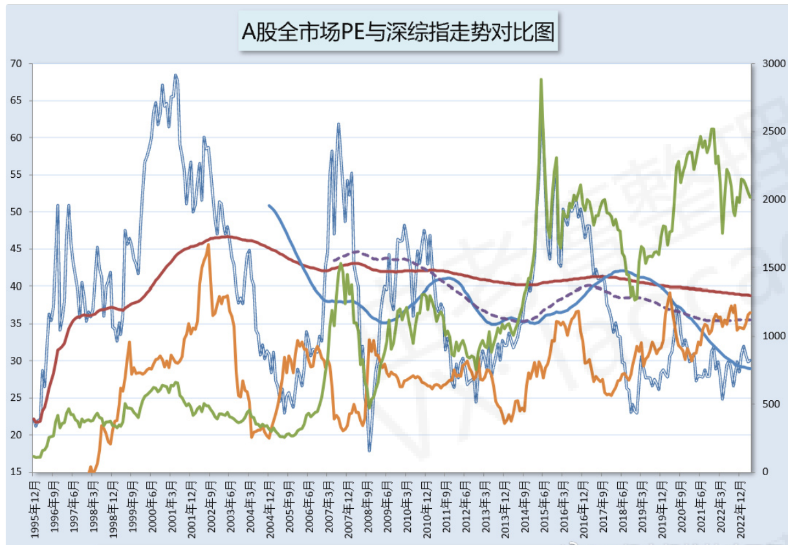

## 2023-01-03 23:12

我们一起来复盘。
如果你是特斯拉的股东，你应该，以及实际上最有可能在哪个位置减仓。
说说你的理由。

评论：我个人认为，300-330 一线卖出就是非常成功的了。

发散： 回踩 5 个月的均线即技术卖出点。

## 2023-01-11 10:27

每年年初都是在微博贴出当年判断，今年也不例外。
这是今年的，跟之前发在公众号的是一样的。留个记录。

所有判断结果，都是以年终视角来看。  
第一，A 股整体表现，尤其是大指数——比如 50、300 等，会明显好于去年和前年。换句话说，这些大指数全年收红的可能性，大于收阴。如果今年因为什么突发利空导致沪深 300 跌至 3450-3500 一线，那么在那个位置买入，来 1-2 年的收益将可以保证。  
第二，如果没有突发特别大的意外，比如去年的欧洲局部地区军事冲突，比如窜访等类似事件，2023 年会明显比 2022 年好做（关键是两大国关系不要大幅恶化）。再发生我去年初说的“22 年会非常非常难做。因为年中的波动会非常怪异，远超绝大多数人的想象”这种情况概率并不大。  
第三，恒生指数，包括中概、恒科，全年收红的概率甚至大于 50 和 300。  
第四，连续四年表现非常好的红利策略，23 年应该会比较黯淡。我不敢说会大跌，但在各个策略、行业的对比中，涨幅应该是排在靠后位置的。  
第五，中小指数，如 500、1000，表现会弱于大指数。我不敢说一定是收阴，但大涨的可能性真的非常低。预期不应该过高。  
第六，我们关注的行业方面，大致上也与 500、1000 类似。如果机构不再疯狂抱团，消费全年大涨的可能性真的不高。比较值得期待的，是如果因为利空因素，医药跌到 9400-9500 左右，全指消费跌到 12000-12500 左右，将为未来若干年的超级收益奠定基础。尤其是消费。如果你能在 13000 以下买入消费，那么未来几年收益率直接起飞。

## 2023-01-15 18:21

看了一眼数据，  
消费，尤其是食品饮料，再涨 13%-20%，就会再次进入死亡区域。  
我请那些新朋友一定要弄清楚，高估的死亡区域不代表不会继续涨，市场的疯狂我们正常人绝对无法预计。只是意味着会非常危险，如果你持有，到时候做好随时跑路的准备就对了。  
那么我们手上还剩下的消费会怎么处理？  
男人不要那么婆妈，直接看操作。

## 2023-01-27 14:04

我个人认为，美元/人民币这里应该是有个支撑。

## 2023-02-01 19:49

其实行情上下就三个维度：  
估值、情绪、货币。  
估值不用说了，货币也不用说，情绪说过很多次了。  
情绪除了刚才说的观察人们的言行举止，还有很多其它信息。  
比如，这样的新闻：  
“基金热卖”，“基金经理封神”，“重要股东减持”，以及，我的评论里出现嘲笑的声音等等。  
所有这些，就可以合并成为情绪指标。其意义，类似于传说中的 90 年代去券商营业部门口数自行车。  
情绪+估值，基本就可以判断铁顶。而一个铁顶不杀个三五十巴仙，不把一批人套个三五七八年，是不会结束的。  
为了防止阅读能力差的朋友误会，我再说明白一点：  
我这些话，是让你留个心眼，知道观察什么，意味着什么，而不是说现在出现了。  
我写的大多数东西不是为了解释过去，也不是为了应对现在，而是准备未来。

## 2023-02-02 09:46

我相信有很多朋友深套的时候不慌，浅套的时候还好，但是一旦回本，开始赚钱，他就慌了。不停的想清仓，怕坐电梯。清了仓又开始发愁什么时候买回来，害怕踏空。  
其实不用慌。  
因为这是正常人类的反应。这就是金融心理学。你不要回避它，也不要懊悔，那些都没用。  
你要做的是设计出交易策略，应对自己的这种心理。  
比如，拿出一部分钱做波段。涨了，你卖了啊，收割了啊，没有坐电梯。  
比如，设定再平衡比例。比如静态的话，永远保持 70%仓位，多了就减，少了就补。  
当这些交易策略融入你的体系，你就会发现不仅收益率有了保证，投资也不再是一件患得患失的，影响你心情的负面事件。  
它多美好啊。

## 2023-02-15 16:43

刚才有朋友说，网格或者致敬挣到了，长赢 150 和 s 没挣到怎么办。  
其实我看了看，致敬的三个品种，150 都是盈利的。s 里面医药信息盈利，恒生浮亏 4%。  
这个问题是这样的，我来慢慢说，你认真看。  
致敬相当于我对极端情况的一种反应。什么是极端情况，就是至少三五年才会出现一次。  
比如恒生的极端情况，过去三十年出现过四次。那么各位可以问问自己，愿意用所有筹码去等这三十年四次的机会吗。  
我关注了十几个品种，到现在致敬也只买了 1+0.5+0.5。对，致敬能挣钱，但我自己都不可能死等致敬。我等不起。  
再说网格。  
这是一个应对波动市的策略。恰恰这几年就是波动市。它正好赶上了，所以上上下下不断提款。  
那如果这几年是单边市呢。会不会有只跟网格的朋友来骂我，为什么大牛市挣不到钱？  
之所以开放不同策略，就是为了“全天候”应对市场。说实话，我不知道接下来是大牛大熊还是波动，我只能从策略上做好准备。然后在极端的时候，拿出银行存款或者理财来买点致敬仓位。  
长赢是长期策略，我们每年都换手率只有不到 20%。于是长期看，四十多个品种只有两三个浮亏，成绩非常好，也证明了低位买入，长期投资是可行的。  
但是，它绝对不可能解决所有问题。全天候的事，还需要全天候的长短策略来搭配。  
这是我的解释说明。满意不满意的，就这样吧。

## 2023-02-16 15:38

除非你说永远不卖，否则，你一定面临怎么卖，何时卖的选择。  
我的一点思考，与君共享。  
第一是左侧。设定减持标准，比如价值，比如技术压力位。到了就卖不含糊。  
第二是右侧。进入减持范围后暂时不动手，让子弹飞。然后设定技术条件，达到后再卖。比如趋势转折等。  
无论是左侧还是右侧，世界上就根本不可能存在一个完美的卖出方案。不可能有人每次都卖在最高点或者高位区域，没有任何人能做到。  
但无论如何，有了减持策略，总比你脑袋一热，随心情交易靠谱得多。

## 2023-02-22 10:39

“新高不卖，新低不买”，其内在意义是在上涨或下跌市场中，不要随意不停的卖出或者买入。否则筹码很容易失去，现金也很快枯竭。  
但这个规则并非铁律。它是一个下位规则。优先等级更高的上位规则包括“价值规则”、“关键点位规则”等。  
比如，当了一个极为关键的压力位，或者价格已经飘到了外太空，则可以根据上位规则的策略减仓加仓，新高新低规则在这个时候就被上位规则所压制，不再发生作用。  
（实例就是三次致敬全都是新低价位）  
就像行政法规、部门规章、规范性文件永远不能凌驾于法律之上，是一个意思。

## 2023-03-01 08:27

其实客观来说，我知道什么是美，但我有自知之明，知道自己的能力达不到创造美。
我解决的方式就是：模仿。
比如从第一套房子开始，装修我就模仿那些我认为美的案例。选定自己喜欢的风格，然后去找喜欢的图片视频学习，从颜色到布局到细节，然后设计实施。
那套房后来上了家居杂志。
模仿，可能是能鉴别美，但无法创造美的人，完成美的一条捷径。
没有能力设计，就去老老实实的模仿。举个例子，你按照大牌服装店模特的穿搭去照买一套搭配，大概率是好看的。

## 2023-03-01 15:53

投资这件事，有几个层级。
第一个是低买。这个相对来说最容易。需要克服的是贪念，恐惧，以及对便宜还是贵有大致的了解。
第二个是高卖。高卖比低买难 300 多个巴仙。通俗来说就是难度成倍增加。道理很简单，不死的品种，跌起来是有底的，比如 7080。但是涨起来是没有上限的。怎么才能卖在相对高位，非常非常困难。
第三个层级是高卖后再低位买回来。
这个尤其尤其难。有时候你会发现高卖了，卖了之后大跌了，但是低位没有再买。经过一段时间，或者很久，价格又比你卖出的高了。
有人说简单啊。10 块钱卖了，8 块钱接回来不就好了吗？
不好意思，没这么简单。为什么呢。如果你有一点点投资经验，你回头看自己那些被深套的品种，是不是都是高位跌了一些然后抄底买入结果抄在半山腰上的？
也许你 10 块真的跑了，8 块你觉得成本低了 20%接回来，结果跌到了 3 块，还持续了 10 年。
所以高卖后，到底什么情况才接回来，真的非常非常难。要么是没接，放跑了大牛。要么是接早了，盈利变亏损，亏掉了整个青春。
难。真的非常非常难。
当然了，喷子们一边看历史 K 线一边说，难个屁，多简单！

## 2023-03-29 14:41

其实我对 A 股某些品种还是挺有兴趣的。有从没买过的，有清仓想买回来的。
大概 2-3 个品种，目前也都在关键点位，买点挺合适。
但还没买的原因就在于仓位。我始终对仓位有严格的限定。目前的仓位与市场状态比，还是比较高，就不能再买，除非卖点什么。
所以还是先不买了。但考虑 S 买点也未尝不可，再看看。

## 2023-04-12 11:27

随着美姨气吞山河的长阳，2023 年第七次提款也已经完成了。
我们的传媒网格也彻底出清。但是，因为留了大量的利润，所以之后如果上涨，依然会不断增厚利润。
我相信，越来越多的朋友已经体会到了金融投资的乐趣——在赚钱的同时。
这种乐趣不仅仅是钱的问题，而是你坚持了正确的事情，然后得到了回报那种成功的乐趣。
各位真要好好谢谢最困难的时候，依然在坚持的自己。
PS，本次卖出后，不再重设本格买入。具体的可以等表格出来后看看。
PS2，表格中会有第一次利润卖出的价位，可以参考。

## 2023-04-13 08:22

我这里，又出现了几个天天没完没了散播悲观，负面情绪的人。
即使我已经用无数实际的案例告诉大家，不要急，最后都会好。
这几个人依然锲而不舍的让自己，让别人不开心。
油气赚了，环保赚了，传媒赚了，只剩中概了，他们就开始盯死中概发散黑暗气息。
我现在依然保持除了广告不拉黑的原则。但我不能容忍我这里长期出现这样的人。
在我这里，无论行情怎么样，即使最黑暗的时候，绝大多数朋友都依然情绪稳定，甚至非常开心。我不能让这几个人影响所有人。
因为在你们的影响下，真的有人会低位割肉，会赔钱！到时候你们拍拍屁股走了，别人怎么办？
我正告你们几个人，你们不属于这里，你们属于天 t ji jin 和支付 bao。那里，全都是你们的同类。
我希望不拉黑，但我不放弃拉黑的选项。我劝你们一小撮负面分子，悬崖勒马，好自为之！
你自己不好好学习，不要影响好好学习的同学！这里是人大附，什么八流学校的差生都混进来了！

## 2023-04-21 15:35

突发新闻：
根据今日数据，全市场估值在 2023 年首次跌入 30 倍区间，同时，150 仓位也已经适配“激进仓
位”区间。
再这样跌几天，差不多加仓就不必受仓位限制了。

## 2023-05-30 11:25

其实金融投资是一项“经验”的活动。

就是说这件事其实没有什么公理、定理、定律。人们通过观察历史的涨跌，总结出一些价值也好，技术也好的规律，应用到接下来的投资活动，寄希望于这些总结出的规律还会继续发生作用。

A 股到目前为止，所有的指数，所有的宽基、行业指数，都依然在历史正常的波动范围内。

所以，我选择相信，历史规律依然会起作用。

没什么道理，要投资，只能相信规律依然在。

直到规律被打破的那一天。

那一天会来吗？谁知道呢。

## 2023-05-30 11:12

还是那句话，除非出现不可预知的系统性问题，我有信心将医药/医疗的整体最大浮亏控制在 10%-15%之间。

只要过去几十年的规律还有效。

## 2023-05-30 11:02

这个品种很有意思，相信很多朋友还有印象。我在这里也请大家跟我一起观察，同时积累更多的经验。

这个品种未来医药底部是不是买回来，我还没有想好。有两个因素让我犹豫，

第一，该品种在中期范围内依然大幅跑赢指数。一个品种，行业基金经理到底能不能长期跑赢行业指数，答案是能。但有多少位，会是谁，很难说。如果某一段跑赢，长期看却跑不赢，那一定是要在接下来还债。

第二，我们买的时候该品种规模只有十几亿，现在已经 50 多亿。规模变大后，是否还能有之前优秀的表现，也要观察。

大家也可以一起观察，相信对自己未来的投资会有好处。

中期跑赢基准，规模变大，是否应该成为我们投资某个品种的考虑因素？

## 2023-05-30 10:23

中证医疗即将跌破 9 字头。  
我立个 flag。  
8 字头配置完毕。 ​​​

## 2023-05-23 15:38

今日数据：
以 80%为上限，中性仓位 45%。
激进、保守加减 15%。

## 2023-05-26 10:05

其实买在最高点的人并不多。
下跌市场中杀伤力最大的，或者说受伤最严重的人，是在下跌中不断抄底，最终在半山腰仓位过
重导致损失巨大。
所以，我们需要原则。
这里需要什么原则？
非常简单：
时间、空间、新低不买。
真正的理解并执行这些简单的原则，就可以保证我们的筹码不会大量集中在某个下跌区间，导致
抄底不成产生巨额亏损。
当然了，有时候原则之间会发生冲突。比如，空间跌出来了，时间也足够了，但是新低了，买不
买？
当然可以买。这时候再引入“合理仓位”概念，不就可以保证风险控制的问题了吗。
新低不买是说不要看到新低就满仓满融杀进去。新低是一个信号，告诉你危险并未结束。但如果
已经有价值，则价值原则与仓位原则可以高于技术原则。
你先综合理解一下。

## 2023-05-31 10:43

对于未来投资规划的一个大思路。
我会尽量将所有品种的成本控制在最后一根支撑附近。力争所有品种的成本不比最低支撑位高超
过 15%。
接下来的事情，就交给天意。
如果几十年最低支撑位能撑住，那皆大欢喜。如果撑不住，就不再看该指数。
如果大多数，甚至所有指数最低支撑位都撑不住，就不再看股市，也不再投入。
至于已经投入的，不可能亏损卖出。这也是我的原则之一。
基本就是这样一个思路。

## 2023-06-06 10:33

医疗再次靠近 9000 点。
如果未来持仓成本能在 8500 附近，那我就非常非常满意了。
那位小白说了，简单啊，8500 再买不就好了吗。
您真不怕跌到 8600 就涨起来，您一分钱也买不到吗。

## 2023-06-18 11:31

一个完整的指数投资体系，应该包括：
观察体系。含估值 情绪 资金。这是起点和基础。
操作体系。
在观察后，得出结论，但结论并不能让我们获利。我们要把结论，比如是否便宜，有多便宜，通过某种方式转化成投资行为。
而转化之前，要设计好各个品种的仓位，买入节奏，极端情况发生的应对措施（压力测试）。
然后，通过投资策略进行交易。
每一个部分都是独立的，每一个部分又融合在一起形成完整的投资逻辑，链条和体系。
金融投资，第一重要的是保住本金，然后才是赚钱。投资不是为了保本，但保本最重要。

## 2023-06-19 10:28

整体来说，人性是不可改变的。
比如说，你一定听过的，“别人恐惧时我贪婪，别人贪婪时我恐惧。”
说起来容易，做起来有多难，经历过的人才知道。有意志力，有智力，有毅力的人，也许有机会做到。但芸芸众生，根本就不可能全都做到。
那么，作为大多数的普通人，就一定没有办法改变在资本市场上被来回收割的命运吗。
当然不是。即使你无法对抗人性，你也不一定会失败。
怎么做？非常简单。
第一，用铁律和策略去裂变另一个你。既然你的人性无法改变，就不去改变。你怎么想并不会影响你的收益，你的收益是由你的操作得来。
那么就很简单了。将你的人性，你的思维，你的恐惧和贪婪，与操作分开。你该恐惧就恐惧，但你依然会点击买入。你该贪婪还贪婪，但你下了卖出的单子。
无论是“不盈利不卖出”，还是“拉开时间空间”，又或者是各种交易策略，都是机械的，不按照你的判断执行的。
无论你的判断是对是错，只要你的操作对了，不就行了吗。
这时候，“执行”是最重要的。
第二，找到支撑。

比如说，你很信任某个人。从一次次历史，一次次现实，你清楚的知道那个人不会被情绪和人性所影响。你知道他很坚定，很顽强，不会被环境和情绪所左右，同时，你又知道自己情绪化，无
法对抗人性，那么你就锚定他。他买你就买，他卖你就卖。
这时候，“信任”就是最重要的。
一个人做事要想成功，要么是自己能够克服人性的弱点，要么是坚决执行设计好的锦囊妙计，要么是跟着意志坚定的人共同完成事业。
选一个合适自己的路，再困难的市场，也未必一定输。

## 2023-06-27 10:07

跟大家说几个数据吧。
全指医药第一次到目前的 10000 点左右，是 2015 年 3 月。
大家可能觉得什么玩意儿啊，8 年没涨啊。
但其实真相是，2015 年 3 月，全指医药 PE60 多倍，PB6 倍。
而 8 年后的一万点，它的 PE 已经降至不到 30 倍。
更离谱的是医疗。
发布于 北京 来自 微博网页版
2023/10/21 00:56 二级市场捡辣鸡冠军的微博 由老曹制作整理 vx:laocao1688, qq:153710139
localhost:8081/u/7519797263-1-1000,2000-2023 218/834
目前医疗 8700 点，第一次见到也是 2015 年 3 月，那时候 PE96 倍。
你能想象 96 倍的指数估值吗。如果你不能想象，那你如何面对 2 个月后，中证医疗 150 倍的估值
呢。
现在，同样的 8700 点，医疗估值已经降至 30 出头了。
股市就是这样。你买的高，要么就用时间，要么就用空间去还债。债是不可能不还的。
不！可！能！

## 2023-07-22 09:32

你有没有发现一个现象：
最近微博财经大 V 的评论里，很多人都把“定投纳指”作为救命稻草。
另外，也有数据表明最近国内的美股基金申购排名靠前。
2023-07-22 09:32 发布于 北京 来自 iPhone 14 Pro Max
2023/10/21 00:56 二级市场捡辣鸡冠军的微博 由老曹制作整理 vx:laocao1688, qq:153710139
localhost:8081/u/7519797263-1-1000,2000-2023 288/834
非常有意思，继续观察。
做投资就是做善事，别人不要觉得很烫手想要打折卖掉你就买点为他们折现，别人争先恐后争着
抢着哭着喊着买你就卖点给他们。
好人有好报。

## 2023-07-26 10:15

接上条。
现在，各位可以与我一起经历一次与上条完全不同的投资路径。
当然了，这条路径之前我们已经经历过几十次，但这次大家可以明明白白的经历一次，看看这里
的朋友为什么会赚钱。
二季度，我们两个计划一共买了 4 份医疗 C。
医疗指数从最高点到目前跌幅将近 60%，我们目前浮亏 4 个多点。
这只跌了 60%的指数基金，二季度我们开始买之前，规模一直是十亿左右。二季度末，我们买了
4 份后，它的规模翻了一倍，变成了 20 多亿。（并不都是我们买的，还有别人在买）
一个指数低位规模大幅增加，若干时间后，投资者会不会赚钱？即使它的净值无法收回 60%的跌
幅，但只要有一点点涨幅，是不是投资者就能整体变成盈利状态？
我要与大家一起做的事情，就是在市场上捡那些别人不要的辣鸡。因为只有捡辣鸡，大家才能一
起挣钱。
而不是说净值有多高，最后绝大多数人赔钱，这是特别可笑的一件事。
不应该是这样的。

## 2023-08-18 15:03

刚才说了医疗的估值状态。至于历史是否有效，我们不急着下判断，一起看。
但你有没有注意我的动作。
在我的估值体系中，即使显示出的如此低估的品种，我依然只给了 150 11%，S 15%的仓位。
而且，在共振的最低点位，我们的指数浮亏也只有 7%。
也就是说：
如果历史有效，我们会赚钱。
如果历史无效，我们不会赔很多。
对了，我们赚钱。错了，我们赔不了多少。这样的输赢概率，这样的死亡概率，值不值得做?

## 2023-08-18 15:18

很多人根本就不明白一件事，
做指数投资，我们分析估值也好，分析百分位也好，分析技术也好，根本不是为了别的，而是服务于最终的对象：
概率。
估值也好，技术也好，都是加减概率的工具。一个品种，你买入，有多大概率赢？这才是关键。
在投资中，因为没有 100%赢的东西，所以你还要考虑，万一黑天鹅发生，即使赢面 99%的投资，却发生了另外的 1%，输掉了整局，那么我会不会死？
很多人就因为自认为赢的概率非常大，所以不顾生死的下注。且不说他的计算是否正确，就说他是正确的，那 1%发生了，死了怎么办？
所以这里的概率要分两部分：
第一，输赢的概率。第二，失败后死亡的概率。
我的理念是永远不死。只要我在市场上玩，无论发生什么，我都不要死。这是最重要的，没有任何东西比这个重要。
所以我也踩过雷，比如油气、传媒、中概。
但在雷区中，我知道我不会死。因为即使这些雷全爆了，我也会安然无恙。我有耐心，有策略，把踩到的雷变成利润拿走。我之所以能把他们变成利润，是因为我没死。不仅账户上没死，心态也没死。
所以各位，任何投资之前，请先想两个问题：
第一，我买入的这个东西，赢的概率是多大。
第二，如果我错了，我输了，我瞬间死亡的概率有多大。它会对我造成多大的伤害。如果它跌 30%、50%、80%，我能扛得住吗——这就是我之前说的，压力测试。
真正成功的压力测试，会让你知道你该投入多少去做这件事。
未完待续。
