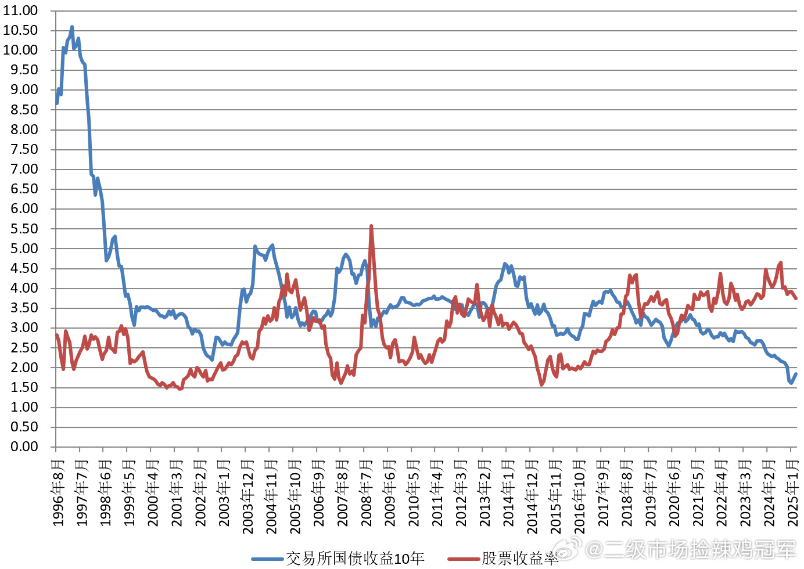

## 25-2-14 10:22

再说一次，无论我多么看好某个品种（个股，行业），我也不会让它超过我投资仓位的 20%。

对，我可能没法通过一个品种暴涨而暴富。

但对我来说，最关键的是不要死。不要因为黑天鹅或者其它什么动物的出现，让我产生大的损失大的回撤。

20%。单一品类。投资仓位，永不会超。 ​​​

## 2025-02-28 09:51

全指信息在我能理解的范围内，最低到最高应该是 80%多的区间。

也就是说，如果你有机会买在最低，卖在最高，会有 80%多收益率。

在我不能理解的区间，会有超过 150%以上的收益。比如 2015 那一波。

一般来说，到了我能理解的最低点，我就会买一笔，致敬我自己的投资系统。到了我能理解的最高点，我就清仓了。

## 2025-02-27 09:54

如果今天 A 股跌，港股涨，那么 150 和 S 的占比就又要超过 15 和 20 趴了，害得继续减。

我其实想把去年 9 月买的那份恒生医疗优化掉，让它暂时毕业。那份买入我的预期收益率应该在 50%+以上。

看看有没有机会吧。继续明牌。 ​​​

## 2025-02-27 09:32

第一，不要预测。即使预测，也不要根据预测去操作。

第二，不要让总资产发生大幅（-35%及以上）回撤。（单独的品种没问题）

适合普通人的建议，万中无一的高手除外。

## 2025-02-26 21:52

当然，关于波段的操作，这几年下来，我又有了不少新的体会和心得。千言万语一两句说不清，以后 gzh 写。

简单的说其中几点。

一个品种不应该间隔太少。别说 3 个点，5 个点都太少。碰到某市场这几年极限的大风大浪，出现过去几十年没出现的情况，没必要这么搞。一个是跌下去压力大，一个是涨起来吃的少。

为什么证券一直让人特别舒服，它波动大当然是一方面，但另一方面，从一开始就给了它 10 个点，也是很重要的因素。

我看券商现在的表格上，间隔都很大，这就比较好了。跌下去资金压力小，涨起来吃得多。

还有几点有空再说吧。总之投资策略，投资模型一定是不断进步，不断成长。

其实每个策略都是小马过河。有人觉得深，有人觉得浅，有人觉得正合适。总之这个策略很适合我本人，我真的非常喜欢它。它给我赚了很多，我会继续做下去，继续提升，继续优化它。

## 25-03-11 14:19

中债，美股，这两年的状态都是非常罕见的。 ​​​

> 新米练习菌:蓝线真低…刚去看一眼最新是 1.9。相当于”债市不再继续走牛，维持平衡的话，投资十年期国债的人，未来十年每年只能拿到 1.9%的收益率“。（倒数）“债券市盈率“=52.6 倍…

> Gu 市收益率虽然没 2024 年高，但依旧有 3.7%，妥妥超 Zhai 的 1.9%，金融市场就是在”买卖货币“，谁的性价比高，就买谁~继续投资性价比高的~然后耐心等待均值回归~

> 图图说：广发中债 7-10 近 1 个月跌幅为 2.18%。

## 2025-03-15 17:54 来自 微博网页版

一般来说——我说的是一般情况，

如果被深套的老股民回本就出了，要等回调再入场，那说明行情大概率有可能还没走完。 ​​​

> 嬴喽: 等老股民再次杀回来的时候就大概率走完了[作揖]
